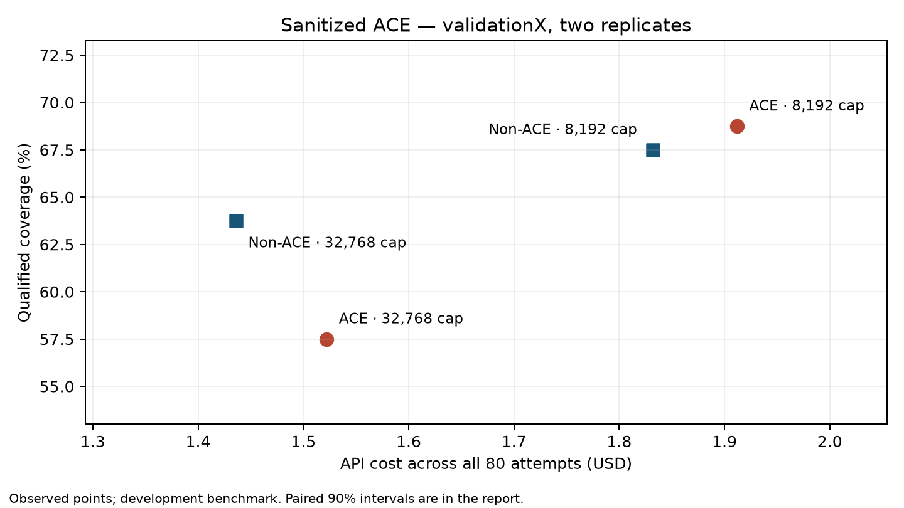

# Sanitized ACE: audit and refinement, September 17, 2026

Completed for **$8.83303748 of the $25 ceiling**: 146 learning cells,
48 isolated proof pilots and 320 validation attempts. Ordinary non-ACE
achieves 63.75% coverage. The 8,192-token cap raises non-ACE to 67.50% and
ACE to 68.75%, with higher spending. At matched caps, ACE gains one qualified
attempt out of 80 for 4.34% more cost; the coverage interval includes no
difference. The refinements remain opt-in, with no default promotion.

The fair headline comparison is the complete ACE system against an ordinary
agentic prover with its normal conversation history. The baseline retains
the same existing proof tools, model, verifier, demonstrations and problem
allowances. It receives no handoff, summary, learned retrieval, reflection,
failure memory or additional tool.

A second comparison gives both agents the selected **generic** controller
and changes only the playbook. This distinguishes a useful complete system
from evidence that ACE itself adds value. If ordinary history is better for
non-ACE, it remains a valid comparator; dropping is not a fairness requirement.
Report the observed non-ACE frontier as well as the preregistered headline.

## Audit of the previous refinement

The September 16 refinement has 24 training pilots and 640 validation
attempts, with $13.53635304 in settled receipts. Its reset is already plain
history removal. Historical suggestions to add a non-ACE handoff are rejected.

| Previous validation arm | Coverage | Cost, all 80 attempts | Budget reduction vs ordinary non-ACE |
| --- | ---: | ---: | ---: |
| Ordinary non-ACE | 60.00% (48/80) | $1.533738 | reference |
| Non-ACE with dropping | 65.00% (52/80) | $1.599090 | −4.26% |
| ACE, ordinary history | 56.25% (45/80) | $1.478931 | +3.57% |
| ACE with dropping | 65.00% (52/80) | $1.666767 | −8.67% |

At matched dropping, ACE adds no coverage and costs 4.23% more. The complete
ACE-with-dropping system gains five coverage points over ordinary non-ACE,
but costs 8.67% more. Both are useful descriptions; neither establishes
that the playbook caused the benefit of dropping. Replicate-level losses
are reported rather than treated as an automatic veto.

The old compact treatment changed both instruction text and feedback. It
reduced input per request but increased request counts, adding no observed
cost/coverage frontier point. Applying its shortening before the drop trigger
also delayed dropping. Common failures included repeated tactics, empty or
suffix-only proofs, absent names, and byte-capped feedback hiding current
goals behind repeated proof prefixes.

Conservative reservation is another distinct mechanism. Among 258 failed
validation cells, 198 stopped at price admission, 55 at verifier admission,
four at the turn limit and one at a provider rejection. Price-stopped cells
had median actual spend about $0.0411 of their $0.10 allowance. Reserving
32,768 output tokens often made the next request unaffordable. The new study
tests an 8,192-token generation limit without weakening the input bound or
campaign ledger. Historical $0.20 experiments helped both agents, so extra
headroom should not be credited specifically to ACE.

Sources: the preserved [previous results](../experiments/campaigns/ace_economy_refinement_20260916/results.json),
[request audit](../experiments/campaigns/ace_economy_refinement_20260916/analysis/request_audit.json)
and [new audit record](../experiments/campaigns/ace_sanitized_20260917/audit.json).

## Registered implementation

The opt-in implementation is isolated in
[`experiments/ace_sanitized`](../experiments/ace_sanitized). Historical source
hashes remain intact. Both agent harnesses run the same Python entry point.

Both proof agents retain `ReadSkill`, `SearchRocq` and `InspectProofState`.
`ReadSkill` reads the pre-existing static references, not the learned book.
Only ACE receives that book; the role tools and learning artifacts are never
advertised to non-ACE. All arms use Luna medium, a $0.10 problem allowance,
64 requests and 300 verifier seconds. Actual transmitted requests confirm
the same three tools and the registered generation limits.

Eight fixed trainX problems first compare six isolated arms: incumbent ACE,
smaller output allowance, one plain history drop, concise instructions/tool
descriptions, bounded feedback/tool views, and a revised book. One combination
of non-dominated individual treatments may then be tested on the same eight
problems. Selection uses the training frontier and lowest cost per qualified
solve, retaining a distinct coverage leader when available. Validation never
changes the frozen treatments.

The drop retains the theorem, verified prefix, last checked proposal and two
recent complete interaction groups. It adds no generated state. It triggers
on raw history (at least eight groups and 24,000 characters, removing at least
8,192), at most once, and clears hidden reasoning from the discarded session.
Rendering happens afterwards, so view limits cannot delay the trigger.

Feedback views preserve raw verifier evidence and prioritize the error and
current goals within 4,096 UTF-8 bytes. They introduce no goal aliases.
ReadSkill retains its existing 8,192-byte output allowance because it has no
pagination. Narrowing a search and inspecting additional goals use only the
existing tool capabilities. Concise tool descriptions retain argument schemas.

A prospective stopping rule requires four identical checked failures with the
same proposal, proof state and error, without new intervening tool evidence.
Unknown/resource outcomes reset the streak. It is evaluated offline during
exact replay; no paid stopping treatment is silently included.

Learning starts from the polished v2 reference book and uses only the forty
frozen trainX sources. Curator/reducer edits, exact checked receipts, review
decisions, intermediate revisions and role checkpoints are retained. The book
is audited and hashed before any proof benchmark. Prior training evidence is
reused; its historical acquisition cost is not new experiment spend.

## Learning pilot results

The 64 fresh role calls cost **$0.18946280**, with no platform failures or
unresolved billing. Both terminal-schema variants now have tools disabled,
correcting the earlier confounded fixture.

| Role pilot | Control | Candidate | Decision |
| --- | ---: | ---: | --- |
| Valid terminal plans | 6/12 | 10/12 | Do not adopt: one new valid plan has unsupported evidence |
| Scored support/novelty decisions | 15/16 | 13/16 | Do not adopt: lower registered accuracy |
| Explicit unsupported-context, open-assertion and missing-premise cases | 3/3 | 3/3 | Both abstain correctly |

Four additional ambiguous positive review fixtures remain unscored on each
side. Original labels are preserved. The new schema's unsupported update
cites a receipt containing only `Check` commands as if a `pow_pos` repair had
been executed. Valid serialization therefore does not establish supported
learning. The extra review wording overextends its scope audit to inherited,
unexercised clauses, rejecting a narrow supported example or an exact
duplicate. The learning pass retains independent evidence review without
either failed candidate treatment.

## Incremental learning

The completed learning stage costs **$0.87974058** including the role pilots;
the forty-source adaptation alone costs **$0.69027778**. All 40 reflectors
complete. Of 32 curators, 26 complete and six retain partial checkpoints;
nine of ten reducers complete. The book preserves every original rule,
attaches 12 examples without changing their rendered text, and adds two
rules (27 → 29 bullets, 8,277 → 9,013 rendered characters).

The retained learning logs contain 19 diagnostics for drop decisions with
nonempty fields and seven invalid terminal plans. These are diagnostic
occurrences, not additional benchmark failures. Six curators and one reducer
end with partial products; their drafts and checked receipts remain in the
durable checkpoints. Better schema validity remains useful work, but the
pilot shows that it must also preserve the link between the claimed operation
and what the receipt actually checked.

The additions concern nested binary disjunctions and cancelling several
reciprocals with a shared product. The latter is an operational refinement
of the existing single-reciprocal advice. Its nonzero premises are explicit;
an extra offline kernel check establishes the three cancellation identities
as one universally quantified local assertion. The outer benchmark theorem
is still open in that audit, which is recorded rather than misreported as a
complete solve. See the [book audit](../experiments/campaigns/ace_sanitized_20260917/book_audit.json).

## Metrics and limits

Coverage is qualified kernel-accepted attempts divided by **all** expected
attempts, including platform failures. Budget reduction is
`100 × (1 − candidate cost / comparator cost)`, including unsuccessful
attempts. Report percentage-point coverage changes separately from relative
budget savings. Administrative censoring or missing cells prevents a verdict.
The main validation percentage averages the two replicates over 80 attempts;
the export also reports the fraction of 40 problems solved at least once in
those two attempts. These are different coverage definitions.

Core validation is 40 problems × two replicates × two arms = 160 fresh cells.
Additional full 80-cell panels require their entire $8 worst-case liability to
fit: matched non-ACE controller, incumbent book under the selected controller,
then a distinct coverage leader. Equivalent panels are reused. There are no
extra seeds or runs bought to cross a significance threshold.

The new hard campaign ceiling is $25, independently accounted from the earlier
campaigns: learning $2, proof development $6, core validation $16, reserve $1.
Unused completed-stage funds can move to complete additional panels.

Costs are recomputed from receipt token counts and dated local pricing.
Reports distinguish inference, adaptation, role-pilot overhead and total new
research spend, and show uncached/common-cache-rate sensitivity. Family-clustered
90% intervals and two-sided p-values describe uncertainty; p<0.10 marks
statistical support rather than an acceptance gate. Replicate labels are not
API random seeds. ValidationX is repeatedly used development data; this is no
independent held-out claim. testX and protected challenge artifacts stay closed.

Cache sensitivity reprices the observed token sequences at other cache rates.
It does not rerun search: different charges could change admission and coverage
under the same $0.10 allowance. Treat it as a cost sensitivity, not measured
cold-cache deployment performance.

The primary pair is interleaved in a fixed shuffled launch. Optional coverage
panels run subsequently, with a fixed shuffle within each panel; their arm
order is not counterbalanced. Provider variation and cache warmth can differ
between batches. Cache sensitivity is reported rather than treating these
measurements as a fully randomized causal study. Intervals and p-values are
unadjusted exploratory comparisons, not held-out confirmation.

Historical acquisition of the incumbent book is excluded from new spending;
it is not free. The selected book is the incumbent, so the experiment's
incremental deployment learning cost is zero. Charging all $0.87974058 of
new learning research to the selected arm is reported as a separate
sensitivity. Neither convention estimates the full historical cost of
building ACE from scratch.

The production defaults are unchanged. Scoped tests, exact HTTP-blocked cache
replay and source/input hashes support reproducibility. Root `make pyright`
still stops on 17 existing missing-`why3py` errors outside this task's scope.
Aggregate test/repricing commands are intentionally excluded because they
access closed partitions.

## Additional local receipt checks

The incumbent `rocq-00025` advice to establish a closed cast equality with
`cbv [INR]; ring` succeeds in a real-valued trainX environment. An initial
check in a natural-only environment failed because `INR` was absent; it
does not refute the advice. These outcomes are kept separately in the audit.

The nearby `rocq-00015` bound-lifting example has a syntax defect:
`change INR 2 <= INR c` is rejected, while
`change (INR 2 <= INR c); apply le_INR; lia` proves the local universally
quantified bound after introducing its natural-number premise. The explicit
cast-equality replacement also checks. This is a contextual syntax finding,
not a general claim that `change` cannot handle closed casts. Receipts are in
the campaign's `audits/cast_bound_recipe.json` and
`audits/cast_real_environment.json`.

## Isolated proof pilots and frozen selection

The 48 fresh proof attempts cost **$1.25201934**, bringing development spend
to **$2.13175992**. Every attempt has an exact HTTP-blocked replay. There
are no platform failures or unresolved charges.

| Eight-case trainX arm | Coverage | All-attempt cost | Budget reduction vs incumbent ACE | Cost per solve |
| --- | ---: | ---: | ---: | ---: |
| Incumbent ACE | 50.0% (4/8) | $0.178168 | reference | $0.044542 |
| 8,192 output tokens | 62.5% (5/8) | $0.270025 | −51.56% | $0.054005 |
| Concise instructions/descriptions | 50.0% (4/8) | $0.184537 | −3.57% | $0.046134 |
| Bounded feedback/tool views | 50.0% (4/8) | $0.179988 | −1.02% | $0.044997 |
| One plain history drop | 25.0% (2/8) | $0.245668 | −37.89% | $0.122834 |
| Audited incremental book | 50.0% (4/8) | $0.193632 | −8.68% | $0.048408 |

Incumbent ACE and the smaller output limit are the observed frontier.
Incumbent ACE remains the primary choice under the registered cost-per-solve
rule; the output limit is retained as a distinct coverage choice. Their
combination equals the existing output arm, so it reuses that paid panel.
The new book and other controllers show no pilot advantage and are not
selected for validation. Eight problems and one replicate provide limited
evidence; these observations do not establish universal regressions.

The concise system prompt falls from 17,275 to 12,132 characters with the
same book and argument schemas. Total requests nevertheless rise from 89
to 99 and output tokens from 61,934 to 75,112. Its total input is almost
unchanged (1.159M to 1.156M). The drop actually fires in six of eight cells;
its total requests rise to 138. Local prompt savings therefore do not imply
lower total search cost. The strict four-identical-failure stopping rule
never triggers on these pilots, so it offers no observed saving here.

All six recorded drops reset the next request's reasoning allowance to zero.
The retained visible interaction history ranges from 4,140 to 17,101
characters, excluding the fixed prompt and separately supplied problem
state. Preserving whole exchanges can leave a large remainder. This is a
single history cut, not a fixed token window or an optimal restart policy.

All 25 unsolved pilot attempts stop at price admission. No pilot response
hits the generation cap: the largest output across all six arms is 3,208
tokens, and the 8,192-token arm's largest output is 1,958. Reducing the cap
releases $0.0294912 of worst-case output reservation per request at the
registered pricing. It permits more search while retaining the $0.10 problem
allowance; its observed benefit is not from paying for longer individual
answers.

With a fixed prompt of size `P` and roughly `g` new context tokens per turn,
resending history for `n` requests has input volume approximately
`nP + g·n(n−1)/2`. Cache discounts reduce its price, not its volume or the
number of requests. This explains why the report measures total input,
output and request counts as well as the initial prompt size. Real traces
have uneven growth, tool batches and opaque reasoning, so this formula is
an explanation of the mechanism, not a fitted cost prediction.

Before opening validation, a separately hashed amendment adds the empty-book
counterpart of the 8,192-token coverage candidate. The ordinary primary
controller makes two originally planned optional panels redundant; this
uses one freed slot. The resulting four panels are ordinary non-ACE,
ordinary ACE, non-ACE with 8,192 output tokens, and ACE with that same cap:
**40 problems × two replicates × four arms = 320 attempts** if funded.
Each optional 80-cell panel requires its full $8 liability to fit the same
$25 ceiling. No treatment, seed count or primary selection changes after
validation begins. See [the frozen selection](../experiments/campaigns/ace_sanitized_20260917/freeze.json)
and [the amendment](../experiments/campaigns/ace_sanitized_20260917/headroom_protocol.json).

## Validation results

All four panels contain 40 validationX problems × two replicates, with no
platform failures, missing cells or cost-cap crossings. Coverage below is
the fraction of all 80 attempts qualified at actual cost ≤$0.10.

| Validation arm | Coverage | All-attempt cost | Budget reduction vs ordinary non-ACE | Cost per solve |
| --- | ---: | ---: | ---: | ---: |
| Ordinary non-ACE | 63.75% (51/80) | $1.435754 | reference | $0.028152 |
| Ordinary ACE, selected on trainX | 57.50% (46/80) | $1.521775 | −5.99% | $0.033082 |
| Non-ACE with 8,192 output tokens | 67.50% (54/80) | $1.832116 | −27.61% | $0.033928 |
| ACE with 8,192 output tokens | 68.75% (55/80) | $1.911632 | −33.14% | $0.034757 |

Negative budget reduction means higher spending. The observed frontier is
ordinary non-ACE, non-ACE with the smaller cap, and ACE with that cap.
Ordinary non-ACE has the lowest cost per qualified solve; ACE with the
smaller cap has the highest attempt coverage.

The primary result favors ordinary non-ACE on both measured objectives.
ACE's coverage change is −6.25 points, with a family-clustered descriptive
90% interval of [−12.50, 0.00] points and two-sided p=0.2344. Its budget
reduction interval is [−18.34%, +4.59%], with cost p=0.3901. The observed
disadvantage does not establish a general negative effect of ACE.
Non-ACE solves 25/40 and 26/40 across the two replicates; ACE solves 24/40
and 22/40. These counts are reported without a per-replicate veto.

With matched 8,192-token caps, ACE gains **1.25 coverage points** for
**4.34% more cost**. Its coverage-change interval is [−2.50, +5.00] points,
p=1.0000; its budget-reduction interval is [−15.29%, +4.64%], cost p=0.4611.
Non-ACE solves 28/40 and 26/40 across replicates; ACE solves 28/40 and 27/40.
Both solve **29/40 distinct problems at least once (72.50%)**. The observed
attempt-level trade-off is small, and statistical support for a playbook
advantage is absent on this panel.

As a complete system against ordinary non-ACE, ACE with the smaller cap
gains five coverage points for 33.14% more cost. Its coverage-change interval
is [0.00, +10.00] points, p=0.2188; its budget-reduction interval is
[−43.85%, −21.03%], cost p=0.0008. This comparison does not isolate ACE.
The matched empty-book controller supplies most of the observed coverage
gain and belongs in any interpretation of the result.

The within-ACE controller contrast improves coverage by 11.25 points
([+5.00, +18.75], p=0.0156) at 25.62% more cost
(budget-reduction interval [−43.68%, −7.13%], cost p=0.0302).
This is evidence for the headroom treatment under this protocol, with the
exploratory and reused-validation limitations above. It is not evidence of
an ACE-specific cost reduction.

## Conversation cost and stopping

| Validation arm | Requests | Total input tokens | Cached share | Incomplete responses |
| --- | ---: | ---: | ---: | ---: |
| Ordinary non-ACE | 1,009 | 10.993M | 69.61% | 1 |
| Ordinary ACE | 990 | 13.480M | 76.49% | 2 |
| Non-ACE, 8,192 cap | 1,203 | 16.502M | 72.83% | 2 |
| ACE, 8,192 cap | 1,195 | 20.015M | 77.80% | 0 |

The smaller cap increases requests by about 20% and total input by about
50% in both agents. That is the observed cost of searching longer while
resending history. Median spend among price-stopped attempts rises from
about $0.039 to $0.064; more of the existing allowance becomes usable.
The remaining failures include verifier-budget exhaustion and other normal
search termination, as recorded in the exported diagnostics.

Five responses reach their generation limits across validation: three at
32,768 tokens and two non-ACE responses at 8,192. Those attempts remain
unsolved; their full costs remain included. ACE at 8,192 has no incomplete
response and a largest output of 5,127 tokens. The lower cap is therefore
not universally free of truncation. Exact cases and receipts are retained
in [the truncation audit](../experiments/campaigns/ace_sanitized_20260917/truncation_audit.json).

At matched 8,192 caps, ACE's actual budget reduction is −4.34%, versus
−14.13% at a common cache fraction and −18.00% with uncached repricing.
For the ordinary pair, these figures are −5.99%, −17.62% and −20.07%.
ACE's higher cache fraction softens its extra token cost. These are
fixed-trajectory sensitivities, with the admission caveat given above.

The preregistered four-identical-failure rule triggers on 14 validation
trajectories, none of which later produces a qualified proof. Its observed
post-trigger charges are reported separately as an offline projection.
The rule did not trigger on trainX pilots and was not selected for a paid
treatment; these savings are **not included** in the table's budget reductions.
At the smaller cap, the projection is $0.12800650 (6.70%) for ACE and
$0.13043078 (7.12%) for non-ACE, five affected attempts each. The ordinary
arms project 0.69% and 1.52% savings respectively. This is a bounded
follow-up hypothesis for the existing stopping implementation.

## Accounting and reproducibility

Learning costs $0.87974058, proof development $1.25201934, and the complete
validation benchmark $6.70127756. Total new spend is **$8.83303748**;
**$16.16696252 remains unspent**. All 5,362 receipts are settled and reconcile
with dated token pricing. Charging all new learning research to the selected
ordinary ACE arm changes its budget reduction from −5.99% to −67.27%.
Historical book acquisition remains separately excluded, not priced at zero.

The [input-parity audit](../experiments/campaigns/ace_sanitized_20260917/comparison_parity.json)
checks all 320 validation inputs: paired proof arguments are identical except
for the playbook, and controller differences are exactly the registered
output caps. Historical and runtime source seals cover 425 unchanged files.
The final report provides cell-level costs, token receipts, paired intervals,
input/archive hashes, and source snapshots. All 514 experiment cells have
exact replay with HTTP blocked; the refreshed certificates retain the helper
source used for each check.

Reporting revision 2 archives its loaded source automatically. It refreshes
the 194 training/learning replay certificates whose earlier helper snapshots
were missing, and reuses the 320 validation certificates with complete
source provenance. Original certificates and measurements are preserved.
This adds no API calls. It also separates nearby plot labels. Canonical
exports are in [analysis/final_v2](../experiments/campaigns/ace_sanitized_20260917/analysis/final_v2),
with certificates in `replays_v2`. The report generator and tests pass scoped
strict types and Ruff; the suite contains 23 offline tests. The broader
type-check limitation remains the 17 pre-existing `why3py` errors noted above.
