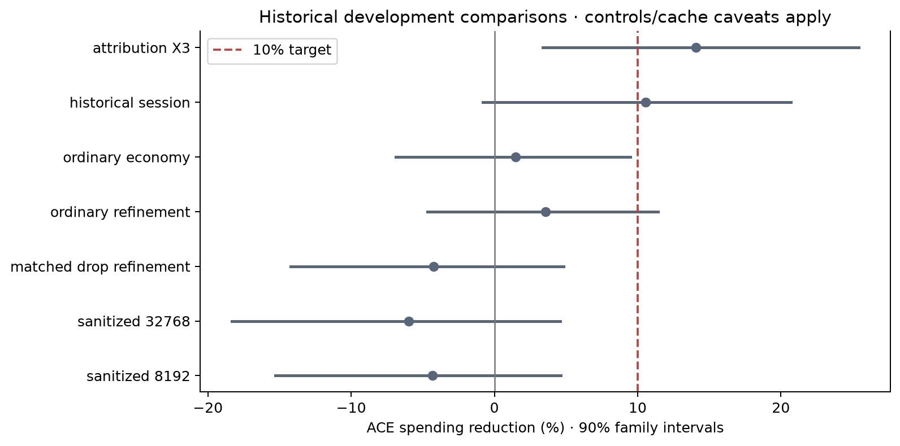
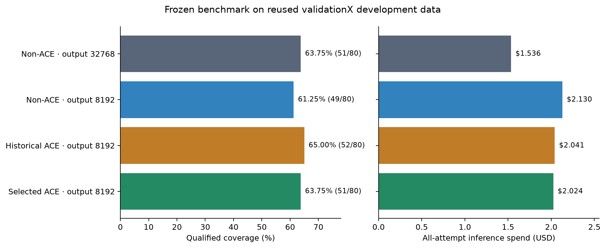
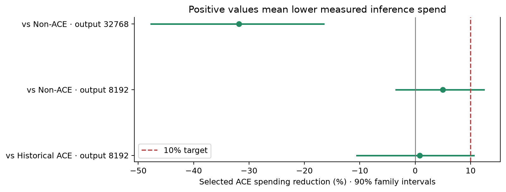

# ACE thesis audit and prospective study — 2026-09-18

**The frozen benchmark does not reach either 10% target.** The selected ACE
artifact solves 51/80 cells, matching ordinary non-ACE, at higher inference
cost. Against the control with the same output limit it gains two solves and
saves 4.97%. Two historical panels do meet the descriptive spending target;
their scope and uncertainty are retained below. This is evidence of a checked,
reproducible implementation, not a general guarantee of ACE improvement.

The approved objective is either **+10 percentage points of coverage**, or
**at least 10% lower all-attempt inference spend without pooled coverage
loss**. Individual replicate losses do not veto a pooled result. Learning
costs are separate from inference, with preparation and amortization disclosed.
The fresh experiment ceiling is $50; older charges remain in their own ledgers.
No solver-model sweep or default promotion is part of this study.

The [protocol](../experiments/campaigns/ace_thesis_20260918/protocol.json)
was written before paid outcomes. The
[source seal](../experiments/campaigns/ace_thesis_20260918/seal.json)
binds 330 implementation, input, statement, demonstration and template files.
Both agent harnesses use `python -m experiments.ace_thesis` from omphalos.
testX and the protected challenge remain closed, including their reports and
mixed aggregate artifacts. ValidationX is heavily reused development data;
fresh model calls do not make its problem selection unexposed.

The [ACE paper, v3](https://arxiv.org/html/2510.04618v3) motivates a
Generator–Reflector–Curator loop, localized updates and grow/refine operations.
It evaluates different tasks and models; its reported agent gain is not a
universal effect size for formal theorem proving. Its cost analysis separates
adaptation and evaluation and discusses cached context. Our inference-cost
endpoint follows that separation. The new example representation is an
application-specific extension, not a claim to reproduce the paper verbatim.

The [official implementation](https://github.com/ace-agent/ace/tree/82709de050e1db6e6ef2f07bcb0393560b94992a)
was inspected at a fixed commit. It includes failure-driven reflection and
regeneration, successful-trajectory reflection, and structured curation. Its
curator implementation currently uses ADD operations despite broader language
in its documentation. Thus concise bullets or ADD-only merging alone are not
proof that an implementation violates ACE.
[Reference hashes](../experiments/campaigns/ace_thesis_20260918/research_sources.json)
bind the fetched source and both local papers. The
[Delphyne paper](https://arxiv.org/abs/2502.05310) supplies the architectural
reference: strategies express proof obligations and choices; policies control
search and resource use. The new study reuses those mechanisms.

The historical audit starts from individual raw records, not earlier assistant
verdicts. It covers **9,923 permitted cells** and **44,819 associated billing
receipts**. Every settled receipt matches dated token repricing; 17 retained
liabilities in the interrupted September 13 role campaign remain unresolved.
They are neither free calls nor evidence of a pricing arithmetic error.
The census includes proof, adaptation, curation and role-pilot cells; its total
is not a theorem-evaluation denominator.
It yields 436 descriptive proof panels and 590 catalogued bullet/version
records. The panel export separates raw completed solves, solves within the
original recorded price allowance, and the common $0.10 qualification used
for the thesis comparisons. An over-cutoff proof is not a failed proof.
Where an archive records no price allowance, the original-allowance column
treats it as uncapped and the raw policy metadata remains the reference.

| Evidence | Reproducible artifact |
|---|---|
| Included and excluded paths | [inventory.json](../experiments/campaigns/ace_thesis_20260918/audit/inventory.json) |
| Expected manifests and missing cells | [compact summary](../experiments/campaigns/ace_thesis_20260918/audit/expected_panel_summary.json), [full local metadata](../experiments/campaigns/ace_thesis_20260918/audit/expected_panels.json) |
| Per-cell prompts, checks, failures and hashes | [audit/cells](../experiments/campaigns/ace_thesis_20260918/audit/cells/) |
| Billing records with repricing and unresolved status | [receipts.json](../experiments/campaigns/ace_thesis_20260918/audit/receipts.json) |
| Descriptive proof panels, including incomplete ones | [panels.csv](../experiments/campaigns/ace_thesis_20260918/audit/retrospective/a37ab9343885ea57/panels.csv) |
| Individual bullet versions and observed prompt exposure | [bullets.csv](../experiments/campaigns/ace_thesis_20260918/audit/retrospective/a37ab9343885ea57/bullets.csv) |
| All 80 permitted exercises, error frequencies and evidence pointers | [problems.csv](../experiments/campaigns/ace_thesis_20260918/audit/retrospective/a37ab9343885ea57/problems.csv) |
| Every unsolved permitted cell and its evidence pointer | [failures.csv](../experiments/campaigns/ace_thesis_20260918/audit/retrospective/a37ab9343885ea57/failures.csv) |
| Recomputed registered historical comparisons | [comparisons.json](../experiments/campaigns/ace_thesis_20260918/audit/retrospective/a37ab9343885ea57/comparisons.json) |

The manifest audit identifies incomplete early X3/no-reflector matrices and
the interrupted role validation. It also preserves the two interrupted raw
refinement cells whose later exact continuations supply the canonical results.
Those continuations are resolved explicitly; summing both archives would
double count problem/replicate cells. Where a manifest is absent or outside the
allowlist, completeness remains unknown. Where no billing ledger can be bound
to a cell, cached token costs are marked as such: unrecorded failed requests
or retries cannot be reconstructed by pretending the successful cache is an
invoice.

For example, the old Terra attribution panel allows $1 per problem and records
29 non-ACE versus 30 ACE successes. Applying the thesis's $0.10 actual-cost
cutoff instead gives 21 versus 20 qualified successes. Both counts are valid
for their stated endpoints; treating the latter as the original solver
success count would reverse the apparent coverage direction. No new Terra
run or solver-model sweep was needed to establish this distinction.

The historical comparisons reproduce these observations, including both
favorable and unfavorable results. Costs include unsuccessful attempts.

| Comparison | Non-ACE solves | ACE solves | Non-ACE dollars | ACE dollars | ACE spending reduction | Coverage change |
|---|---:|---:|---:|---:|---:|---:|
| X3 attribution, 40 cells | 24 | 27 | 0.776512 | 0.667228 | **14.07%** | +7.50 pp |
| Historical session control, 80 cells | 50 | 50 | 1.677397 | 1.500466 | **10.55%** | 0 pp |
| Ordinary economics, 80 cells | 47 | 46 | 1.496212 | 1.474255 | 1.47% | −1.25 pp |
| Ordinary refinement, 80 cells | 48 | 45 | 1.533738 | 1.478931 | 3.57% | −3.75 pp |
| Matched history dropping, 80 cells | 52 | 52 | 1.599090 | 1.666767 | −4.23% | 0 pp |
| Sanitized, output 32768, 80 cells | 51 | 46 | 1.435754 | 1.521775 | −5.99% | −6.25 pp |
| Sanitized, output 8192, 80 cells | 54 | 55 | 1.832116 | 1.911632 | −4.34% | +1.25 pp |

The first two rows meet the **descriptive** spending target on their recorded
panels. A blanket statement that no previous material ever reached 10% would
be incorrect. Conversely, those rows do not establish a reliable improvement
of at least 10% on future problems. X3's cost-ratio 90% interval is
[0.7456, 0.9662], with two-sided cost p=0.0498; the interval does not establish
the 0.90 threshold. Its coverage p=0.25 does not establish a coverage gain.
The session ratio interval is [0.7931, 1.0080], with cost p=0.1365.
These are retrospective comparisons on selected, reused validation problems,
with historical controls and differing cache conditions. Sparse-discordance
bootstrap intervals are descriptive and should not override the paired tests.

The X3 attribution comparison has matching observed model, effort, tools,
64-request and 300-verifier-second limits, focused control, and output ceiling.
The session comparison likewise matches the session mechanism. Thus neither
favorable result should be discarded merely because a non-ACE run lost on a
replicate. Cache reuse is a real charged-cost mechanism, but historical run
order is a confound when assigning its benefit to ACE. The new benchmark
interleaves treatments and reverses their order in the second replicate.

The [X3 reproduction follow-up](ace_x3_reproduction.md) resolves a legacy
ledger alias missed by the initial census: all 447 historical X3 receipts
are settled and exactly confirm $0.66722836. Its saving depends on a larger
cached-input discount; two shorter proof searches account for 58.90% of the
net dollar difference. **The fresh X3 arm is not an exact replication:**
both historical arms used 32768 output tokens, while fresh X3 and its
matched control use 8192. The playbook and initial chats/tools match.
The fresh X3 saving is 4.21%; causal separation of cache conditions, search
variation and changed output reservation remains unresolved. The original
44,819-receipt census and its lookup flags remain preserved; the follow-up
separately binds the missing 447 X3 receipts without altering old exports.
It also reconciles the second historical X3 replicate: 26/40 at $0.76607986,
only 1.34% cheaper against the same non-ACE reference. There is no second
matching non-ACE replicate, so this is a sensitivity check, not another
independently controlled comparison. Both historical X3 draws are retained.

| Implementation family | Mechanism established by source inspection | Main interpretive limit |
|---|---|---|
| v1 | Stable bullet IDs, deterministic ADD merge, lexical deduplication, counters rendered in the generator context | Counter changes alter prompts; recorded counters do not by themselves prove useful refinement |
| X2 | Counter-free generator rendering, pluggable deduplication, prune/merge refinement, offline/online and multi-epoch variants | The small context guard and accumulated prompt cost can limit learning; incomplete cells must remain visible |
| X3 | Versioned reference-oriented prompts, four-example batches and reducer; a larger guard for the three-epoch variant | Rendering/citation and request-budget versions are separate treatments, not interchangeable controls |
| X4 | Reflector sees cited bullets; only those counters change | Missing generator citations restrict the evidence reaching refinement |
| X5 | Failure digest, reference grounding, trivial-solve skipping and terminal audit | A bundled method arm; checking that a name exists does not prove a tactic or its prerequisites |
| Triggered hints / repairs | Error-conditioned rule selection and concrete repair mining | Added repair calls consume the same budget; a local repair need not finish a theorem |
| Bounded / polished | Focused proof state, verifier budgets, money admission, optional repair/control changes | Controller changes can dominate the context effect; compare matching controls |
| Role revision / learning | Typed products, exact snippet receipts, semantic review, incremental application, partial journals | Review remains a model judgment; execution in one context is not universal validity |
| Economics / sanitized | Explicit receipt accounting, transport snapshots, replay, isolated generic controls | Output reservation and history management benefit non-ACE too |
| New thesis revision | Checked examples become visible context, with exact source prefix and observed outcome | Longer context can improve transfer or merely increase cost; validation decides |

The most concrete representation defect was in the role-revision path:
`action=example` stored a checked receipt while the generator received only
`after.render_prompt()`. The sanitized learning cycle attached twelve
examples that therefore never entered its generator context. The new artifact
exposes those examples and one checked cast repair. It preserves stable IDs,
uses a 32 KiB UTF-8 rendering ceiling, and omits whole examples when necessary.
All thirteen initial examples fit in 21,877 bytes. Their exact source contexts
were freshly re-executed before any paid development call.

Evidence strength is explicit. A located lemma establishes a name; a snippet
receipt establishes execution in its recorded imports, hypotheses and prefix;
an open receipt can still leave new obligations; a local-progress observation
has a stronger but local meaning; only a successful final `Qed` closes the
theorem. The renderer states this distinction and retains remaining goals.
Generator prompt exposure is measured separately from causal use. The bullet
census marks render variants it cannot identify rather than labeling missing
matches as proof that a rule was never shown.

Several inspected cases explain why broad claims about model weakness or
useless playbooks are premature:

| Permitted case / mechanism | Raw observation | Consequence for implementation or interpretation |
|---|---|---|
| `rocq-00015` cast-bound recipe | `change INR 2 <= INR c` is a syntax error; the parenthesized recipe executes in the real source context | Correct only the new artifact; preserve the historical defect and its receipt |
| `rocq-00025` closed casts | `cbv [INR]; ring` succeeds in its real-valued source environment | An earlier nat-only check did not refute this recipe |
| `aime_1988_p3` | Logarithmic normalization reaches useful equations, then fails on field side conditions, orientation or focus; the output-cap pilot finishes it | Both local advice and generic headroom matter; do not attribute the cap effect to ACE |
| `amc12a_2020_p13` | Useful logarithm/positivity progress is followed by `ring_nf`, Lean-style `.mp`, or missing coercion normalization | Name grounding alone does not eliminate syntax transfer or algebraic prerequisite errors |
| `mathd_algebra_185` | Finite-set construction gets stuck on freshness, inductive membership, focus and unavailable `omega` | A local empty-set example is useful evidence, not a complete cardinality proof |
| `mathd_algebra_224` | The real/natural characterization can succeed while `Union`/`Singleton` unfolding, membership construction or an unbounded destruct loop fails | Separate mathematical progress, library representation and verifier-resource failure |
| `mathd_numbertheory_221` | The same closed finite computation succeeds in one request under several books | Extra context is not necessary for every exercise; easy solves must remain in the cost denominator |
| Earlier `Nat.pow_inj_r` revision | Positivity alone was generalized beyond the stronger base premise | Do not reuse unsupported generalizations merely because a local numeral check succeeded |

The machine-readable failure appendix preserves all permitted cases, including
successful checks preceding a terminal failure. Its automatic categories are
triage labels, not proof of a mathematical impossibility or a model-capacity
ceiling. Errors from resource exhaustion remain distinct from logical rejection.

The [active-rule review](../experiments/campaigns/ace_thesis_20260918/audit/rule_review_v2.json)
records an assessment of every rule, its checked examples and their actual
rendering. Fresh signature checks distinguish missing imports from nonexistent
names: `le_gt_dec` is unavailable with the default imports plus `Reals`, but
available with `Arith`; cardinality constructors require the set libraries.
The [minimal recipe probes](../experiments/campaigns/ace_thesis_20260918/audit/recipe_probes.json)
also confirm an inherited orientation defect in rule 24:
`rewrite Nat.square_le_mono; lia` fails on a symbolic square bound, while
`rewrite <- Nat.square_le_mono; lia` succeeds. Rule 1 overstates the necessity
of rewriting: specializing the defining equality followed by `nra` succeeds
in a minimal example. These late audit findings do not alter the registered
treatments. They limit claims about the advice, while final proof acceptance
continues to depend on Rocq. No claim that every learned rule is universally
correct follows from a sound proof-checking implementation.

The soundness boundary is concrete: generator suggestions enter a strategy
that checks them; policies govern request and verifier budgets; the external
ledger accounts for dispatched requests, including failed attempts. Role
products and snippet receipts constrain learning, but neither the generator
nor its reviewers are trusted to establish theorem truth. Exact replay checks
that the same cached computation gives the same result and spent budget;
fresh-process compilation independently checks the actual returned proof.
Neither test proves that a suggested tactic is useful on future goals.

The new experiment selects twelve trainX theorems prospectively by a fixed
hash order, six competition and six Mathd, with distinct detected families.
Round 1 compares X3, polished v2 and the example-bearing artifact on two
replicates each. Round 2 compares the selected artifact with one further
training-derived revision. Selection minimizes all-attempt cost per qualified
solve among candidates clearing the strongest historical candidate's pooled
training coverage. It does not search p-values or impose per-replicate vetoes.

| Round 1 treatment | Solves / cells | All-attempt dollars | Dollars / solve |
|---|---:|---:|---:|
| X3 | 18 / 24 | 0.526731 | 0.029263 |
| Polished v2 | 17 / 24 | 0.546047 | 0.032120 |
| Examples | **19 / 24** | **0.437728** | **0.023038** |

The example-bearing artifact was selected. These are training results, not the
thesis benchmark. One provider rejection remains an unsolved cell in its panel;
its early termination can affect the spending comparison. The explicit
[incident record](../experiments/campaigns/ace_thesis_20260918/operations/round1_incident.json)
preserves that rejection and the original receipt. Forty-four collateral
administrative pauses were continued only after HTTP-blocked equality of their
cached prefix, next request, transport state and spent budget. No rejected
request was retried or rewritten, no solved outcome was replaced, and all
money remains in the same ledger. Interrupted directories remain intact;
canonical paths resolve the completed continuations through documented links.

A secondary diagnostic removes the rejected theorem/replicate pair from both
the example and X3 panels: costs become $0.435837 and $0.456963, respectively,
only **4.62%** savings. This does not replace the registered full-panel result
or select a new artifact. It shows why the initial 16.90% training saving
cannot by itself substantiate a 10% claim. Uncached repricing also reverses
that training cost ordering; observed caching contributes materially.

The learning pass completed 12 reflectors, nine curators and three reducers
for $0.220005. It added exact induction-premise type matching and a quadratic
root-factorization workflow, plus six context-bound examples. Reducer block 1
rejected a transitivity example as support for multiplication monotonicity and
a linear `nra` proof as support for square nonnegativity. All accepted edits,
receipts and prerequisites were inspected before round 2. The
[review](../experiments/campaigns/ace_thesis_20260918/round2_audit.json)
binds the 29-rule revision. Its 19-example bank renders 18 complete examples
in 32,152 bytes; one example is omitted by the predefined whole-example cap.
The omitted example is the inherited `ln_mult` case from `amc12a_2020_p13`.
The bank preserves it, but deterministic hash ordering under the cap changes
generator exposure. No isolated causal conclusion follows from that omission.
Several snippets leave the theorem open, as their labels state. Successful
execution supplies local evidence, not a general tactic-completeness claim.

| Round 2 treatment | Solves / cells | All-attempt dollars | Selection |
|---|---:|---:|---|
| Retained example artifact | 19 / 24 | 0.493497 | Retained |
| Further learned revision | 17 / 24 | 0.471615 | Below the 18-solve floor |

The second revision is cheaper but loses pooled coverage. It is preserved as
an unsuccessful development result, not promoted. All 28 distinct returned
proofs from round 2 compile in fresh Rocq processes. The first example-bearing
artifact is frozen for validation; no further development rounds are added.

Before validation the selected artifact is frozen. The benchmark has at most
four 80-cell panels: ordinary non-ACE with output 32768, matched empty context
with output 8192, the selected historical book at 8192, and the selected revised
artifact at 8192. Identical treatments share a panel. All retain the same Luna
medium model, original tools and demonstrations, normal history, $0.10 proof
allowance, 64 requests, and 300 verifier seconds. No new non-ACE memory,
retrieval or tool capability is introduced. The matched empty context isolates
the context contribution from generic output-budget headroom.
The selected context is a package of inherited polished rules, one audited
syntax correction, and checked examples. A benchmark effect belongs to that
package; the individual contribution of each component remains unresolved.

The verified [machine-readable results](../experiments/campaigns/ace_thesis_20260918/analysis/8a0e952bec9d71f5/results.json)
are accompanied by [all logical cells](../experiments/campaigns/ace_thesis_20260918/analysis/8a0e952bec9d71f5/cells.csv),
[all new receipts](../experiments/campaigns/ace_thesis_20260918/analysis/8a0e952bec9d71f5/receipts.csv),
and [the 40-theorem comparison](../experiments/campaigns/ace_thesis_20260918/analysis/8a0e952bec9d71f5/validation_by_theorem.csv).
The export records the loaded reporting-source hash independently of the
prospectively sealed experiment implementation.

| Frozen validation treatment | Solves / cells | Coverage | All-attempt dollars | Dollars / solve |
|---|---:|---:|---:|---:|
| Ordinary non-ACE, output 32768 | 51 / 80 | 63.75% | 1.535809 | 0.030114 |
| Matched non-ACE, output 8192 | 49 / 80 | 61.25% | 2.130285 | 0.043475 |
| Historical X3, output 8192 | 52 / 80 | 65.00% | 2.040559 | 0.039242 |
| Selected ACE, output 8192 | 51 / 80 | 63.75% | 2.024399 | 0.039694 |

| Selected ACE compared with | Coverage change (90% interval), pp | Spending reduction (90% interval) | Coverage p | Cost p |
|---|---:|---:|---:|---:|
| Ordinary non-ACE | 0.00 [−3.75, 3.75] | −31.81% [−47.69, −16.55] | 1.0000 | 0.0027 |
| Matched non-ACE | +2.50 [−1.25, 6.25] | +4.97% [−3.47, 12.38] | 0.6250 | 0.3358 |
| Historical X3 | −1.25 [−8.75, 6.25] | +0.79% [−10.53, 10.56] | 1.0000 | 0.9047 |

Negative spending reduction means a cost increase. None of the selected
artifact's contrasts reaches a point-estimate target. The matched comparison
also does not establish a positive coverage or cost effect statistically.
The ordinary comparator has lower measured cost with the same pooled coverage;
that cost difference has nominal statistical support on this development
panel. The preregistered historical arm is secondary: compared with matched
non-ACE it gains 3.75 points and saves 4.21%, also short of both targets.
It is not substituted for the training-selected artifact after seeing results.

Standalone PDF versions are available for the
[benchmark](../experiments/campaigns/ace_thesis_20260918/analysis/8a0e952bec9d71f5/figures/validation.pdf),
[uncertainty](../experiments/campaigns/ace_thesis_20260918/analysis/8a0e952bec9d71f5/figures/cost_uncertainty.pdf)
and [historical comparisons](../experiments/campaigns/ace_thesis_20260918/analysis/8a0e952bec9d71f5/figures/historical.pdf).

Replicate solve counts are 25/26 for ordinary non-ACE, 23/26 for matched
non-ACE, 26/26 for historical X3, and 26/25 for selected ACE. Across both
replicates the two non-ACE arms each solve 26 distinct theorems, and the two
ACE arms each solve 27. Those union counts are an additional endpoint, not
the preregistered per-attempt coverage denominator.

All four denominators contain 40 theorems and two replicates. The ordinary
non-ACE arm contains one provider rejection; its preceding charges remain
included and it contributes zero solves. Twenty-seven collateral pauses
passed exact HTTP-blocked checkpoint checks before continuing under the same
cell identities, inputs and budgets. The
[validation incident](../experiments/campaigns/ace_thesis_20260918/operations/validation_incident.json)
and [recovery record](../experiments/campaigns/ace_thesis_20260918/operations/validation_recovered.json)
preserve the originals. No rejected request was retried or rewritten. There
are no missing or administratively censored cells in the final comparison.

A secondary failure diagnostic removes `amc12a_2020_p21`, replicate 1, from
every arm together. The selected artifact then costs 29.30% more than ordinary
non-ACE and saves 5.39% against matched non-ACE; the conclusion is unchanged.
This 79-cell diagnostic does not replace the registered 80-cell analysis.

The selected artifact wins four and loses two individual cells against the
matched empty context. Gains occur on `aime_1984_p7`, `aime_1991_p9`,
`amc12_2000_p12` in replicate 0 and `mathd_numbertheory_405` in replicate 1.
Losses occur on `amc12_2000_p12` and `amc12a_2008_p4` in replicate 1. The
former loss involves repeated verifier timeouts; the latter reaches 42 checks
but still has open goals. The opposite outcomes on `amc12_2000_p12` across
replicates illustrate why individual replicate losses are not an appropriate
veto. These traces diagnose specific runs; they do not identify a causal
example or justify another outcome-driven revision.

The selected context uses 24.06 million input tokens versus 17.32 million for
the matched control, and 590,019 output tokens versus 642,027. Its cached-input
fraction is about 80.7%, versus 67.5%. Consequently its small charged-cost
saving must be reported alongside its greater context volume and uncached
price sensitivity. The generic output-limit change also does not reproduce
the favorable coverage direction observed in some earlier panels.
Repricing the same tokens without cache discounts makes selected ACE 30.36%
more expensive than matched non-ACE and 81.87% more expensive than ordinary
non-ACE. These are price sensitivities, not uncached reruns: the archived
search paths and qualified proofs stay fixed.

The `seed0`/`seed1` names denote independent API replicates, not a guarantee of
deterministic provider sampling. Reproducibility comes from archived requests,
responses, verifier records and exact replay. Interleaving reduces simple arm
ordering bias but does not eliminate shared provider-cache effects or variable
worker completion times. Intervals cluster repeated observations by theorem
family detected by normalized statement templates and competition variant
identifiers: the frozen validation map contains 40 families. This mechanical
grouping may miss semantic near-duplicates.
Reported p-values are nominal across the documented contrasts; there
is no multiplicity-adjusted claim across the historical search history.

Preparation is not free. Two measured inherited learning components are
$0.450930 for polished v2 adaptation and $0.879741 for the prior example
learning, totaling $1.330671. The
[receipt-bound record](../experiments/campaigns/ace_thesis_20260918/inherited_preparation.json)
does not pretend to be a complete from-scratch estimate: X3 authoring, source
generator episodes, earlier selection studies, engineering time and local
verification resources are additional. This campaign spends $2.475619 on
the two proof-development rounds and $0.220005 on learning, or $2.695623
before validation. The report presents incremental learning and full new
development amortization separately whenever measured inference savings
make a break-even calculation meaningful. Neither includes all inherited
preparation or the evaluator's control-panel measurement overhead.

At the matched-control point estimate, recovering this campaign's $0.220005
role-learning spend takes 167 additional problem attempts; recovering all
$2.695623 of new preparation takes 2,037. Including the two measured inherited
components raises that partial-accounting figure to 3,042. These calculations
assume the observed saving persists; its interval crosses zero, so none is a
guaranteed payback time. The learning pass produced a rejected revision and
is disclosed as study preparation, not a required deployment step for the
selected artifact. There is no inference-saving break-even against ordinary
non-ACE. Total new API spending, including all four evaluation arms, is
**$10.42667544 of $50**, across 5,753 fully settled, exactly repriced receipts.
The unused ceiling does not justify extra selection rounds.

Independent compilation passes for **all 231 distinct returned proofs**, which
cover **293 successful proof runs** across development and validation. Each
source preserves the original statement, imports and preamble and replaces
only its target `Proof. Admitted.` with the actual returned proof and `Qed`.
`Print Assumptions` is retained. Eighty-one distinct proofs are closed under
the global context; the others use the real library's classical/extensionality
assumptions. Eight proofs of `amc12a_2016_p3` additionally use the original
benchmark's `Rfloor` parameter and `Rfloor_spec` axiom. Those declarations are
part of the supplied formalization, not assumptions introduced by ACE.
The soundness claim is therefore relative to Rocq and these declared
foundations, not a claim that every benchmark has an axiom-free formalization.

The sealed offline checker initially rejected five statement headers because
they have local binders before the colon. A separately recorded
[compatibility wrapper](../tools/maintenance/ace_thesis_kernel.py) accepts those
headers without changing theorem statements, proofs, compiler or allowance.
Its regression checks cover binder syntax, unchanged ordinary headers, wrong
names, admissions and multiple targets. The original failure log and checker
remain intact.

Verification includes 48 distinct passing scoped tests, clean scoped Ruff and
Pyright, and the dual-harness invariant check. The root type-check target
stops at 17 unrelated errors caused by unavailable `why3py.simple` in
`examples/find_invariants`; core typing passes. Global test/partition/repricing
commands that could open closed data are intentionally replaced by scoped
checks. **All 462 completed jobs replay exactly**, with identical outcomes,
returned values and spent budgets, and **zero new paid calls**. The two
provider-rejected jobs remain explicit failures among the 464 registered jobs.
All canonical raw cache/result hashes remain unchanged after replay. The
[compiler certificate](../experiments/campaigns/ace_thesis_20260918/kernel_checks.json),
[exact compiler source bundle](../experiments/campaigns/ace_thesis_20260918/kernel_sources.json),
[assumption summary](../experiments/campaigns/ace_thesis_20260918/assumptions_summary.json)
and [replay certificates](../experiments/campaigns/ace_thesis_20260918/replays/)
accompany the report. Final claim exports require matching certificates;
a missing or stale certificate refuses export.

A defensible thesis statement is: “On a complete, reused 40-theorem development
panel, the historical X3 ACE implementation reduced observed all-attempt
inference expenditure by 14.07%, while qualified coverage increased from
60.0% to 67.5%. The cost-reduction interval was 3.38%–25.44% at 90% confidence.
This meets the descriptive 10% spending objective on that panel, but does not
establish a population improvement of at least 10%. A later frozen comparison
of an example-bearing revision did not reproduce that objective.” The separate
80-cell session comparison supplies another 10.55% observation at equal pooled
coverage, with an interval that includes no saving. Reporting only the
favorable panels would omit material contrary evidence.

The implementation contribution is independently reviewable: exact example
provenance becomes generator-visible context, learned edits remain incremental,
proof truth remains external to the LLM, and complete costs and denominators
are reproducible. The evidence supports this implementation and the scoped
historical observations. It does not support a universal performance claim,
an isolated causal claim for examples, or default promotion. Concrete further
corrections remain local hints #134 and #135; the completed study authorizes no
additional paid search for a favorable result.
