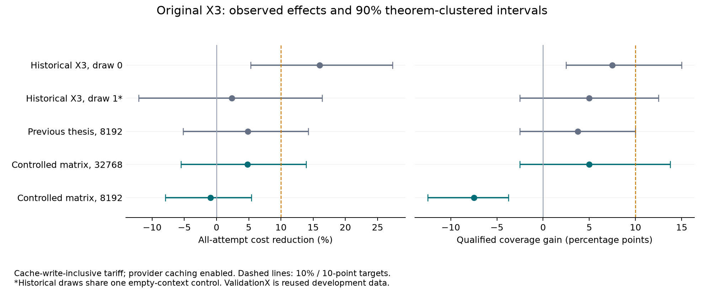

# X3 reproduction investigation

Version: 2026-09-18. This report supersedes the **cost accounting** in the
earlier thesis and X3 reports; their original figures and artifacts remain
preserved. The fixed 320-cell matrix is complete, every attempt replays
exactly, and every successful proof passed independent compilation.

**The registered 10% goal was not reproduced.** At the historical 32768
output cap, X3 saved 4.78% and solved 50/80 versus 46/80. At 8192 it cost
0.94% more and solved 45/80 versus 51/80. No samples were replaced or added.
The experiment cost $8.00405126; corrected cumulative thesis spending is
$19.70941565, below the original $50 ceiling.

The historical improvement is real arithmetic on the archived runs. It is
not an established repeatable 10% population effect. Earlier comparisons
also changed the output reservation, so they were not exact repetitions of
that experiment. This investigation separates accounting, compatibility,
sampling variation, provider caching and the cap treatment.

## Accounting correction

The old ledger and repricer shared the same omission: cache-write tokens
were charged as ordinary input. Agreement between them was therefore not
independent verification of the full tariff. Provider usage retains separate
read/write categories. At the published Luna Standard short-context rate:

```
cost = ((input - cached - writes)*0.20 + cached*0.02
        + writes*0.25 + output*1.20) / 1_000_000
```

The campaign adapter also handles the dated July 30 reduction, long-context
multipliers, service tiers and regional endpoints. Missing categories fail
closed. Conservative liability reserves all potential input as cache writes,
including applicable long-context and maximum supported tier/region rates.
Sources: [pricing](https://developers.openai.com/api/docs/pricing),
[Luna model](https://developers.openai.com/api/docs/models/gpt-5.6-luna),
[prompt caching](https://developers.openai.com/api/docs/guides/prompt-caching).

| Panel | Solves | Legacy cost | Corrected tariff cost |
|---|---:|---:|---:|
| Historical empty, replicate 0 | 24/40 | $0.77651210 | $0.87872550 |
| Historical X3, replicate 0 | 27/40 | $0.66722836 | $0.73807391 |
| Historical X3, replicate 1 | 26/40 | $0.76607986 | $0.85797086 |
| Previous thesis empty, 32768 | 51/80 | $1.53580888 | $1.71574778 |
| Previous thesis empty, 8192 | 49/80 | $2.13028512 | $2.41161182 |
| Previous thesis X3, 8192 | 52/80 | $2.04055918 | $2.29444108 |
| Previous thesis selected examples, 8192 | 51/80 | $2.02439902 | $2.25622122 |

The original X3 saving changes from **14.07% to 16.01%**; the other X3 draw
gives **2.36%**, using the same single empty control. The latter is sensitivity
evidence, not a second independently controlled experiment. The previous
fresh matched X3 saving changes from **4.21% to 4.86%**. Corrected prior thesis
spend is **$11.70536439**, including development/learning, rather than
$10.42667544. Original historical endpoints were not recorded; these are
published-tariff reconstructions, not invoice claims. All 1,410 recovered
historical responses confirm the Standard service tier.

On the original comparison, the 90% theorem-clustered cost-ratio interval is
[0.7267, 0.9468], with two-sided cost sign-flip p=0.0250. This supports a cost
benefit in this sample but does not put the entire interval beyond 10%.
The alternate X3 draw has interval [0.8362, 1.1212], p=0.7897. The previous
matched comparison has interval [0.8575, 1.0519], p=0.4383. These are
retrospective, reused-development comparisons, not randomized confirmations.

## What supplied the historical improvement

The 24→27 result is **+7.5 percentage points**, or **+12.5% relative coverage**.
Those are different claims; it is not a ten-percentage-point coverage gain.
At corrected cost, `imo_1960_p2` saves $0.03828276 and `amc12b_2002_p3`
saves $0.03517882. Together they supply **52.23%** of the $0.14065159 net
saving. Both change from long unsuccessful empty trajectories to short X3
successes. Their fresh ordinary controls in the prior thesis both solve
2/2, removing those particular historical advantages. The third historical
coverage win, `aime_1991_p9`, solves 2/2 with fresh ordinary empty context
but 0/2 with fresh X3 in that earlier matrix.

The dossiers preserve the actual tactics and checker feedback. In
`imo_1960_p2`, the empty run cycles through algebra and incomplete `Qed`
attempts; X3 reaches a checked inverse/algebra proof. In `amc12b_2002_p3`,
the empty run has invalid `change`/substitution and incomplete proofs; X3
uses factorization and divisibility. In `aime_1991_p9`, the successful old
X3 path establishes inverse/trigonometric identities and factorization.
These describe observed paths. They do not prove a particular bullet caused
the outcome, and no such assertion is inferred from prompt exposure alone.

Holding the old generated traces fixed, ordinary uncached token pricing is
$1.44867800 for empty and $1.46974720 for X3: X3 is 1.45% more expensive.
The full corrected saving decomposes into **−$0.02106920 from token volume**
plus **+$0.16172079 from net cache discounts, including write premiums**.
This is an accounting identity, **not an experiment with caching disabled**.
The old panels ran on different days; provider cache state and workload
timing were not randomized. The receipts cannot identify how much cache
advantage came from intrinsic repeated context versus incidental warmth.

## Output reservation changes the search

Both original panels used 32768 output tokens. The prior fresh matched arms
used 8192. Their first complete chats and tools match the archived ones, but
the lower cap removes **$0.02949120** from the legacy per-request worst-case
output reservation. Under a $0.10 controller allowance, it admits further
search even when actual responses are much shorter than either ceiling.

The event audit finds **28/80 X3 and 28/80 empty** matched cells admitting
at least one request whose 32768 reservation would exceed remaining budget
on that observed prefix. This demonstrates changed admission. It does not
determine what the model would generate on another trajectory or establish
counterfactual coverage. The new matrix measures the two caps in both arms.

In the new matrix, the corresponding counts are **27/80 X3 and 26/80 empty**.
Typed request normalization binds every affected trajectory to its cached
tail; YAML omission of optional defaults must not be treated as a missing
request. The `admission_tails_v2.json` exports supersede the original tail
linking attempt while preserving its unchanged affected-cell counts.

## History rewrites explain a concrete cache failure mechanism

Focused repair regenerates the *initial* theorem message with a new verified
prefix and focus instruction. When the decision class changes, it can also
replace the two demonstrations near the start of the conversation. Tools
and model options stay constant within these trajectories. This is visible
in the actual rendered requests, not inferred from a lower cache percentage.

Of 1,952 rewrites in the 440 historical/previous cells, 1,521 change only
the theorem message and 431 change both demonstrations and that message.
In the new 320 cells, there are 1,412 rewrites: 1,089 theorem-only and 323
also replacing demonstrations. Delphyne keys each assistant's reasoning
cache by the complete preceding request. A changed earlier message therefore
changes that key. Logs show **2,294 previously hit reasoning entries becoming
misses** on new-matrix rewrites, versus zero on append-only transitions.
These are repeated lookups, not 2,294 unique reasoning objects. Demonstration
misses are excluded from these counts.

| Panel | Rewritten requests | Cached input on append-only requests | Cached input after rewrites |
|---|---:|---:|---:|
| Historical empty | 175 | 91.41% | 25.42% |
| Historical X3 draw 0 | 128 | 93.91% | 37.21% |
| Historical X3 draw 1 | 168 | 92.81% | 36.35% |
| New empty, 32768 | 312 | 92.97% | 24.66% |
| New X3, 32768 | 305 | 94.18% | 38.11% |
| New empty, 8192 | 418 | 94.91% | 27.84% |
| New X3, 8192 | 377 | 95.12% | 30.93% |

For example, historical empty `imo_1960_p2` request 2 rewrites message 5.
The preceding request had 3,976 cached input tokens and a hit for assistant
message 6; the rewritten request has 2,607 cached tokens and misses for
messages 6 and 11. Subsequent append-only requests can hit the newest
assistant while still missing those older entries.

The source chain is [query construction](../prove_grounded.py#L501),
[prefix template](../prompts/grounded/generation/ProposeProofScriptGrounded.instance.jinja),
the decision-specific templates, and Delphyne's
`translate_chat_for_responses` reasoning-cache lookup. This mechanism exists
in both arms and in old and new traces; it is not a newly introduced X3-only
bug. Different failure paths induce different rewrites and token costs.
The conditional cache percentages do **not** estimate a causal saving from
fixing the mechanism. A separately versioned append-only repair treatment
remains follow-up hint #138; this experiment did not alter the controller.

## Compatibility and proof soundness

All **239 completed cells out of 240 compatible previous attempts** replay
exactly with HTTP blocked, preserving every prompt/cache lookup, proof
result and legacy spent budget. The original provider failure remains in
the denominator. This checks the new adapter against the existing complete
8192 and ordinary-32768 trajectories without buying another response.

All **1,410 original provider outputs and token usages** match the archive
under the current parser. All 120 first-request input bounds match. However,
stored GET responses omit encrypted reasoning bytes: 844 later request bounds
cannot be reconstructed exactly from those responses. Explicit retrieval of
encrypted content was rejected by the provider. Consequently full historical
transport replay is established for **28/120 cells**, not falsely asserted
for all 120. This is an archival limitation, not evidence that the fresh
implementation has lost its reasoning cache. New runs preserve original
create responses and complete transport snapshots.

The old budget transport source was recovered exactly from git. The old
`prove_grounded.py` hash was absent among seven available path revisions;
candidate diffs have many now-optional features, and are not presented as
the exact old file. No immutable backend model ID is available beyond the
`gpt-5.6-luna` alias, so model drift cannot be established or excluded.

Every historical success freshly compiles: **77 cells / 71 distinct proofs**.
Compiler output and `Print Assumptions` are retained. The original benchmark
axioms and Rocq library foundations remain visible; compilation is relative
to those declarations. Full proof scripts are not accepted merely because
an LLM or prior report calls them correct.

The census scans all **928 permitted validation cells using the exact X3
rendered book**, grouped into 20 configurations after removing incidental
snapshot paths. It retains different effort levels, policies, caps and
budgets rather than pooling them as interchangeable replications. The other
historical 10.55% session claim uses a different book and history treatment.

## Registered controlled study

Original X3 versus empty, each at 32768 and 8192; all 40 validationX problems,
two fresh replicates, 320 attempts. Same Luna medium, demonstrations, tools,
history, 64-request and 300-verifier-second limits. Arms rotate per theorem
and reverse in replicate 1. Runtime is pinned to 24 workers / 32 stream
slots. No learning, new artifact selection or extra seeds after outcomes.

Provider caching stays enabled, with fresh local caches and no artificial
warmup. Metadata-only diagnostics compare consecutive responses; the
[provider documents](https://developers.openai.com/api/docs/guides/prompt-caching/diagnostics)
that these comparisons do not change caching behavior or model generation.
The $0.10 **legacy control allowance** reproduces historical admission;
corrected provider-tariff cost is recorded independently. Raw coverage and
corrected-cost≤$0.10 qualified coverage are both required in the report.

The new ceiling is $20, with $18 for the matrix and $2 for infrastructure
recovery, inside the original $50 thesis authorization. Unknown billing
pauses dispatch. Unfavorable attempts are not replaced. Administrative
censoring prevents a complete verdict. Inherited book preparation is not
new learning in this matrix; inference savings do not imply free acquisition.

## Complete results

All 320 registered attempts completed, with no provider failures or
administrative censoring. Every success also costs at most $0.10 under
corrected accounting, so raw and qualified coverage coincide.

| Arm | Solves | Coverage | All-attempt cost | Cost per solve |
|---|---:|---:|---:|---:|
| Empty, 32768 | 46/80 | 57.50% | $1.67164672 | $0.03634015 |
| X3, 32768 | 50/80 | 62.50% | $1.59180079 | $0.03183602 |
| Empty, 8192 | 51/80 | 63.75% | $2.35926838 | $0.04626016 |
| X3, 8192 | 45/80 | 56.25% | $2.38133537 | $0.05291856 |

At 32768, X3's **4.78% saving** has 90% clustered interval **−5.50% to
+13.91%**, cost p=0.4392. Its **+5-point coverage** change has interval
−2.5 to +13.75 points, paired family p=0.46875. Replicate solves are
23→24 and 23→26. At 8192, the saving is **−0.94%**, interval −7.98% to
+5.39%, cost p=0.8175. Coverage changes **−7.5 points**, interval −12.5
to −3.75 points, family p=0.03125; replicate solves are 25→21 and 26→24.
All p-values are two-sided and unadjusted. The coverage percentile intervals
are descriptive; the discrete family tests need not agree with them at
every boundary. ValidationX remains reused development data, not confirmation.



The registered cap-by-book interaction is **−12.5 coverage points** when
moving from 32768 to 8192, with 90% clustered interval [−21.25, −5.0].
Its cost interaction is +$0.00127391 per attempt, interval
[−$0.00144025, +$0.00405103]. Lowering the output cap increased total spend
41.13% for empty and 49.60% for X3. This reflects the complete cap treatment,
including its more permissive monetary admission, not a free efficiency
improvement. These data do not attribute the entire outcome difference to
admission alone.

X3 at 32768 has **12.39% lower cost per qualified solve**, including failed
attempt costs. Its joint 90% bootstrap interval is **−7.70% to +29.26%**.
This useful secondary descriptive result does **not** satisfy the registered
10% reduction in total panel spend, or measure spending required for equal
coverage. It must not be substituted for that target after seeing outcomes.
At 8192, cost per solve is 14.39% higher.

Actual terminal evidence distinguishes controller stops from proof errors:

| Arm | Solved | Money admission stop | Verifier-time admission stop |
|---|---:|---:|---:|
| Empty, 32768 | 46 | 29 | 5 |
| X3, 32768 | 50 | 23 | 7 |
| Empty, 8192 | 51 | 22 | 7 |
| X3, 8192 | 45 | 26 | 9 |

Thus all 128 unsuccessful attempts stopped on a registered resource
admission limit: 100 money and 28 verifier time. This does not imply that
increasing a limit would solve them. The dossiers retain every checked
script, failing tactic, accepted prefix, returned proof and token usage;
`analysis/termination.json` retains the actual terminal admissions.

## Where the old number went

Normalize the two fresh 32768 replicates to 40 attempts. Original net saving
was $0.14065159; new net saving is $0.039922965. The **$0.100728625 gap**
has the following exact descriptive decomposition:

| Exercise/group | Original saving | New mean saving | Loss of saving |
|---|---:|---:|---:|
| `amc12b_2002_p3` | $0.03517882 | −$0.014460745 | $0.049639565 |
| `imo_1960_p2` | $0.03828276 | −$0.010514125 | $0.048796885 |
| Other 38 combined | $0.06719001 | $0.064897835 | $0.002292175 |

Those two exercises account for **97.72% of the gap**. All eight new attempts
on each exercise solve; at 32768, empty uses 3/4 requests versus X3's 11/9
on the AMC exercise, and 8/6 versus X3's 30/3 on the IMO exercise. Original
empty failures became cheap successes; X3's paths were sometimes longer.
The 38-problem remainder is a net sum of gains and losses, not evidence that
each other exercise is stable. The complete ranking is in `gap_by_theorem.csv`.

An independent accounting identity splits the same gap into **$0.07827010**
of worsened fixed-trace token-volume difference and **$0.022458525** of
reduced net cache advantage. X3 still has a net cache advantage in the new
32768 comparison. Neither this split nor the exercise split identifies
causal contributions from provider warmth, model drift or random search.

| Proposed explanation | Finding |
|---|---|
| The historical arithmetic was invented | Unsupported: all 1,410 original receipts and outputs reconcile; the original draw really exceeds 10% observed savings. |
| Cache pricing errors created that saving | Refuted for this omission: correcting write premiums increases the historical saving to 16.01%. |
| Earlier replication changed the search | Demonstrated: 8192 replaced 32768 and admits more search; the new factorial matrix quantifies the treatment. |
| Two unstable search wins drove the old advantage | Demonstrated concentration: 52.23% of old saving and 97.72% of today's dollar gap. This is arithmetic, not causal attribution. |
| Focused repair can invalidate reusable context | Demonstrated from rendered changes, reasoning-cache keys and recorded hit-to-miss transitions. |
| Provider cache warmth caused a known fraction | Not identifiable: different-day historical controls, no randomized cold-cache arm, incomplete diagnostics. |
| The solver backend changed | Not identifiable: stored responses expose an alias, not an immutable backend identity. |
| The proof checker accepted false reported successes | No evidence in checked results: all historical and new successes compile independently against the benchmark declarations. |
| A stable 10% ACE effect is established | No: the alternate historical draw and both fresh same-cap comparisons fail the registered total-cost/coverage target. Failure to establish is not proof of a zero effect. |

## Verification and delivery

All **320/320 fresh cells replay exactly with HTTP blocked**. All **192
successful cells / 151 distinct proofs** independently compile. Sixty distinct
proofs are closed under the global context; the others expose Rocq real-number
foundations/extensionality, and seven also use the benchmark's `Rfloor`
declarations. These assumptions are preserved in compiler certificates.
No success relies merely on a previous report's assessment.

The ledger reconciles **4,451 provider responses** to $8.00405126, including
five incomplete responses charged normally. All record Standard tier. Cache
diagnostics report 2,733 `cache_hit`, six `input_changed`, 1,391 `unavailable`
and 321 absent comparisons. `unavailable` and absent are not cache hits;
`cache_hit` does not mean the whole prompt was reused. Token usage and local
reasoning-cache logs provide the more detailed evidence above. Provider
caching was enabled throughout; uncached fixed-trace prices are only a
sensitivity calculation.

All **53 scoped integration tests** (including 28 reproduction tests), lint,
scoped typing and dual-harness invariants pass.
Root `make pyright` was run and retains 17 existing `why3py.simple` dependency
errors outside this change's scope. Broad tests and repricing targets that
can open closed testX data were replaced with explicit scoped checks.
Changes are staged without committing. No default is promoted and no further
paid trials were added. The raw archive remains local and must accompany
the compact review exports for full replay.

## Evidence

Campaign: [protocol and commands](../experiments/campaigns/ace_x3_reproduction_20260918/README.md).
The campaign includes the immutable manifest and paid source seal, corrected
receipt exports, source-history comparison, historical parser/replay checks,
kernel certificates and complete per-exercise dossiers. Earlier thesis
measurements remain preserved. No testX or protected challenge data was opened.
