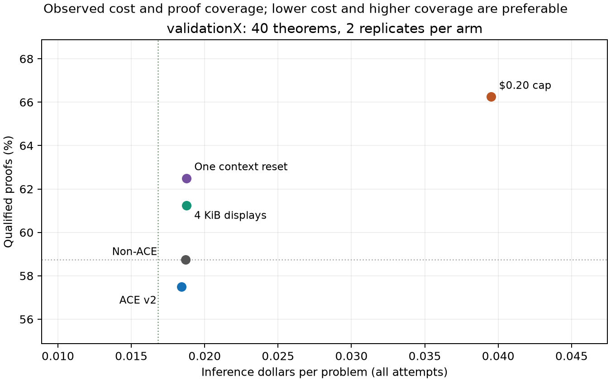

# ACE economics and advisor experiments — 16 September 2026

**ACE with session reset achieves the observed 10% cost-reduction target:**
both matched reset arms solve 50/80, and ACE costs 10.55% less. The
statistical evidence remains inconclusive. The original comparisons without
reset save only 1.47% at $0.10 and 0.34% at $0.20. Session boundaries and
smaller tool displays are promising advisor interventions; larger allowances
buy additional coverage at substantially higher cost. No default has changed.

Guille clarified that **quality means code and implementation quality**.
The inferred requirement to preserve proof counts in every replicate is
withdrawn from the current assessment. See the [seven-comparison reassessment](reassessment/README.md)
and its [current decision records](reassessment/results.json). Original
measurements, protocols and gate outputs remain historical evidence.

**New API spend across all three campaigns: $13.98159180 of the $50 ceiling;
$36.01840820 unspent.** All 560 paid runs use validationX: 40 problems,
two replicates, seven measured configurations. The first two campaigns
account for 480 runs and $12.30419518; the later non-ACE reset adds 80 runs
and $1.67739662. Reused controls are not charged twice. There are no missing cells, platform
failures, monetary cap crossings or unresolved charges. Costs include all
unsuccessful attempts and use provider token receipts with dated prices.

The latest instruction, **"Never touch testX"**, governs this report.
No testX experiment was launched. Before that correction, setup read its
partition list and hashed statement files under the initial instruction.
That access was disclosed; all later work, including verification, uses
validationX only. The original mixed seal remains untouched and retired.
[The scope amendment](validation_scope.json) records this transition.
There is no held-out confirmation, and validationX is repeatedly reused
development data.

**Objective 1 — ACE versus a matched non-ACE agent.** The reference is the
accepted frozen polished v2 book/controller, with an empty-book version of
the same proof loop as control. The later v3 learning candidate missed its
previous gate. The v2 book's known closed-cast advice defect remains
explicitly recorded; no new repair is mixed into this assessment.
Both agents use Luna medium, Responses, core tools, definitions, focused
verification, 64 requests, 300 verifier seconds and a 32768-token output
allowance. Matched pairs differ only in the book.

| Per-problem allowance | Non-ACE proofs | ACE proofs | Non-ACE cost | ACE cost | ACE saving | Cost ratio, 90% CI |
| --- | ---: | ---: | ---: | ---: | ---: | --- |
| $0.10 | 47/80 | 46/80 | $1.496212 | $1.474255 | 1.47% | 0.9853 [0.9051, 1.0688] |
| $0.20 | 53/80 | 53/80 | $3.172176 | $3.161323 | 0.34% | 0.9966 [0.8740, 1.1320] |

At $0.10, cost/solve is $0.031834 for non-ACE and $0.032049 for ACE;
cost p=0.7731. At $0.20 it is $0.059852 and $0.059648; cost p=0.9660.
Coverage p=1.0 at both allowances. The $0.20 comparison was registered from
the budget trial's validation evidence before paying for its missing
non-ACE control; its ACE controls were run hours earlier. All comparisons
cluster both replicates by theorem family: 80 cells, 40 families.

Per-replicate coverage describes run variation. At $0.10, non-ACE has 24/40 and 23/40,
versus ACE's 24/40 and 22/40. At $0.20, non-ACE has 26/40 and 27/40, versus
ACE's 25/40 and 28/40. Neither no-reset allowance reaches the observed 10%
saving target; these coverage fluctuations are not an additional veto.
These samples do not establish equivalence
or prove that a 10% effect is impossible on a different panel.

ACE made 968 requests versus 1082 at $0.10: **10.54% fewer requests**, but
input tokens increased 1.22% and output tokens increased 6.15%. Larger
requests absorbed the savings. With the same token traffic repriced without
caching, ACE would cost $3.256635 versus $3.188264 at $0.10, and $6.462324
versus $5.775917 at $0.20. This is a pricing sensitivity, not another run.

Historical book preparation adds **at least $1.36785368**, excluding
embeddings, before amortization. It is sunk spending outside this session's
$50 ceiling. Adding that lower bound to the first 80 ACE attempts gives
$2.842109 versus the non-ACE $1.496212; preparation must be amortized once
across actual reuse before making an end-to-end savings claim.

The [ACE paper](https://arxiv.org/abs/2510.04618v3) reports a 10.6% headline
accuracy improvement; its adaptation-cost reductions compare other
context-learning methods. Our 10% inference-cost target is the user's
practical objective, rather than a literal replication of that headline.

**Objective 2 — advisor interventions, with implementation quality first.** Each intervention
changes one factor from the $0.10 ACE reference and uses a complete
80-cell panel. Nothing is combined or promoted after inspecting outcomes.

| ACE configuration | Proofs | Total cost | Cost / solve | Coverage by replicate | Current interpretation |
| --- | ---: | ---: | ---: | --- | --- |
| Reference | 46/80 | $1.474255 | $0.032049 | 24, 22 | Reference |
| $0.20 allowance | 53/80 | $3.161323 | $0.059648 | 25, 28 | More coverage at higher cost |
| One context reset | 50/80 | $1.500466 | $0.030009 | 25, 25 | Promising efficiency improvement |
| 4096-byte displays | 49/80 | $1.499764 | $0.030607 | 23, 26 | Promising efficiency improvement |

1. **Session boundaries are the best next development reference.** One
   reset after at least eight interaction groups and 24,000 visible history
   characters retains the last two groups, the latest checked proposal,
   complete tool-call/result pairs, the theorem and the full verified proof
   prefix. It clears discarded reasoning carryover and grants no extra
   budget. It triggered in 32/80 runs, removing a median 20,668.5 characters
   per reset. Coverage rises by four proofs for 1.78% more cost, lowering
   cost/solve 6.36%. Coverage p=0.3594; cost-ratio 90% CI [0.9379, 1.0991].
   This is a practical development candidate; generalization remains uncertain.

2. **Enough budget improves observed coverage for both agents.**
   Raising ACE's allowance yields seven more proofs but 114.44% more cost
   and 86.11% higher cost/solve. Its exploratory coverage p=0.0391 is
   unadjusted; a three-comparison Bonferroni adjustment gives 0.1172.
   This is useful coverage headroom, with a substantial cost premium.
   The old efficiency gate is retained as history, not as a rejection of
   the coverage gain. Non-ACE likewise improves
   from 47 to 53 proofs at $0.20. Notably, 52 of the 53 successful larger-
   allowance ACE runs actually spend at most $0.10. Conservative reservation
   of a full possible response can prevent a useful next request before
   actual spending reaches the nominal allowance. Hint #131 remains open
   for a study of reservation and output headroom that measures coverage
   and cost together.

3. **Smaller tool/feedback displays are a promising additional candidate.** Halving the display
   limit from 8192 to 4096 bytes produces three more pooled proofs for 1.73%
   more cost, lowering cost per solve by 4.50%. Losing one proof on replicate
   0 does not negate that aggregate improvement. Coverage p=0.25; cost-ratio
   90% CI [0.9511, 1.0881]. Only three families are discordant, so the positive
   descriptive bootstrap coverage interval does not supply confirmatory
   evidence. Full proof outputs were not truncated by this intervention.

4. **Verbosity, caching and output filters were audited offline.** The ACE
   system prompt is 17,275 characters versus 8,577 without the book. The
   skills index contributes about 785 characters and tool schemas about
   2,202; removing skill guidance saves relatively little prompt text and
   may affect solve coverage. The measured interventions deserve priority over blanket
   text shortening. Cached input still costs money: the $0.10 ACE panel
   bills $0.198042 for cached input, $0.640009 for fresh input and $0.636204
   for output. With a fixed prompt P and h new history tokens per turn,
   resending history takes roughly nP + h*n*(n-1)/2 input-token work; caching
   reduces the billed coefficient, not the history itself. Session resets
   reduce median last/first request input growth from 2.26x to 1.95x here.
   One reference output hit 32,768 tokens and returned 1.43 million
   characters. The recorded tails motivate careful output/reservation work;
   the effect of a blanket generated-proof cap on solve coverage was not tested.

See open hints **#109** (rendered context) and **#131** (conservative
admission) in the local backlog. We stop at the registered panels instead
of adding seeds or spending the remaining authorization to chase significance.

The dotted lines mark non-ACE coverage and 10% lower cost than its $0.10
reference. Points are descriptive; each configuration has 80 attempts.
The [paired-cost figure](figures/paired_costs.pdf) gives family-clustered
90% intervals for the four main comparisons. The matched $0.20 follow-up
is in the table above and its [separate results](../ace_economy_budget_20260916/results.json).

**Evidence and checks.** [Full main cells](cells.csv), [paired results](analysis/results.json),
[corrected prompt audit](analysis/diagnostics.json), [dated receipts](analysis/receipts.csv),
[proof values and budget outcomes](analysis/outcomes.json), and the
[SHA-256 archive inventory](analysis/archives.json) preserve denominators,
prices and local raw-artifact identity. Corresponding follow-up exports live
in `../ace_economy_budget_20260916/`. Large raw caches, snapshots and SQLite
ledgers remain locally archived. The corrected audit counts nested assistant
answers and tool results omitted by the original basic character profiler;
monetary comparisons use token receipts throughout.

All 21 focused tests pass, including scope rejection before file reads,
conservative joint accounting, three paid-reference parity checks and a live
Rocq/mocked-provider session reset with exact replay. All 560 paid cells across
the three campaigns pass exact cache replay with HTTP blocked; their
certificates retain complete cell lists. Replay compares outcome, proof values
and spent-budget state, and creates no paid receipts. All 14 changed Python
files pass pinned Pyright 1.1.406 and Ruff; dual-harness invariants pass.
Root `make pyright` encounters 17 preexisting `why3py.simple` errors outside
Omphalos. Aggregate tests, partition checks and global repricing were excluded
to honor the dataset closure; receipt repricing is scoped to these campaigns.
See [verification details](checks/verification.json).

Topic commits separate the preexisting ACE learning implementation,
its measurements, advisor documentation, the new economics implementation
and protocols, and these validation-only results. All code changes are
inside `examples/omphalos/`.

**Subsequent matched session-reset follow-up (2026-09-16).**
The [new comparison](../ace_economy_session_20260916/RESULTS.md) adds
80 non-ACE reset runs. Both reset arms solve 50/80; ACE is 10.55% cheaper
($1.50046594 versus $1.67739662), meeting the observed budget target under
the user's clarified objective. Cost p=.136499 remains inconclusive. Combined new spending across
all three campaigns is now $13.98159180/$50. The earlier results and
gate outputs remain historical; current interpretations above are corrected.
