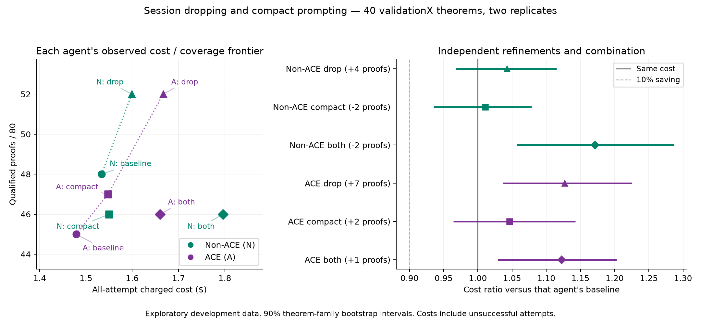

# Session dropping helps coverage; compact prompting does not improve the frontier

Completed September 17, 2026: 24 trainX pilot runs and all **640 registered
validationX runs**, for **$13.53635304 of the $20 additional ceiling**.
The validation panel contains 40 theorem families, two replicates and eight
configurations. testX and challenge data were not accessed by this campaign.

The **10% ACE cost-saving target is not reproduced against the non-ACE
frontier**. Plain session dropping is the useful refinement: non-ACE reaches
52/80 solves for $1.59909032, versus ACE + drop's same 52/80 for $1.66676660.
ACE costs **4.23% more** in that comparison. Compact prompting and the
combined treatment add no point to the overall cost/coverage frontier.

These are numeric cost/coverage conclusions. Implementation quality was
checked independently; no per-replicate solve-count veto was applied.
No default is promoted.

## Complete matched results

Each row contains 80 attempts on the same 40 problems. A qualified solve is
a checked proof within the original $.10 allowance. Costs include unsuccessful
attempts and the preserved provider failure. “Compact” bundles shorter system
prose with compact feedback/tool-result presentation; this experiment does
not isolate those two presentation components from each other.

| Agent | Treatment | Solves / 80 | Charged cost | Cost / solve | Replicate solves |
|---|---|---:|---:|---:|---:|
| Non-ACE | Baseline | 48 | $1.53373770 | $0.031953 | 23, 25 |
| Non-ACE | Session drop | 52 | $1.59909032 | $0.030752 | 26, 26 |
| Non-ACE | Compact | 46 | $1.55000506 | $0.033696 | 23, 23 |
| Non-ACE | Both | 46 | $1.79600940 | $0.039044 | 23, 23 |
| ACE | Baseline | 45 | $1.47893070 | $0.032865 | 24, 21 |
| ACE | Session drop | 52 | $1.66676660 | $0.032053 | 27, 25 |
| ACE | Compact | 47 | $1.54775862 | $0.032931 | 23, 24 |
| ACE | Both | 46 | $1.65970478 | $0.036081 | 23, 23 |

[Standalone PDF](analysis/cost_coverage.pdf). The dotted lines connect each
agent's observed frontier; they do not represent a fitted response curve.

## Objective 1: a fair ACE cost comparison

The non-ACE frontier consists of baseline and plain drop. Neither compact
configuration is competitive with those points. ACE's own frontier contains
baseline, compact and plain drop, but the overall frontier contains only
ACE baseline, non-ACE baseline and non-ACE drop. In particular, non-ACE
baseline dominates ACE compact, and non-ACE drop dominates ACE drop in the
observed totals. “Dominates” here describes this panel, not a population claim.

| Matched setting | ACE cost change versus non-ACE | Solve difference | Cost ratio, 90% CI | Cost p |
|---|---:|---:|---|---:|
| Baseline | −3.57% | −3 | 0.9643 [0.8857, 1.0466] | .4819 |
| Session drop | +4.23% | 0 | 1.0423 [0.9516, 1.1423] | .4674 |
| Compact | −0.14% | +1 | 0.9986 [0.9132, 1.0936] | .9794 |
| Both | −7.59% | 0 | 0.9241 [0.8373, 1.0161] | .1920 |

No ACE configuration is 10% cheaper than either non-ACE frontier point.
The apparent advantage against non-ACE “both” uses a comparator that is
itself worse than its baseline and drop alternatives. It is not the fair
headline comparator. All sixteen cross-setting ACE/non-ACE comparisons are
published in [results.json](results.json), rather than only favorable pairs.

The earlier frozen reset study observed 10.55% savings at equal coverage.
That historical measurement remains intact. This fresh comparison of the
refined controls does not reproduce it; it also does not retroactively
change the earlier samples. Equal solve counts do not establish equivalence.
The fixed book's preparation costs are historical and excluded here: these
are inference costs, not an end-to-end ACE training-cost replication. The
fixed v2 book retains its previously documented advice limitations.

## Objective 2: independent refinements and their combination

**Plain dropping is promising for both agents as a coverage/cost trade-off.**
Non-ACE improves from 48 to 52 solves for **4.26% more total cost** and
**3.76% less cost per solve**. Both replicates improve. This panel therefore
does not show the feared aggregate performance harm from resetting non-ACE.
Coverage p=.3125 and cost p=.3480 remain inconclusive; that uncertainty does
not veto its practical promise. The cost-ratio 90% interval is
[0.9673, 1.1150], and the coverage-change interval is [0, 11.25] points.

ACE improves from 45 to 52 solves for **12.70% more total cost** and
**2.47% less cost per solve**. Its coverage gain is 8.75 percentage points,
90% interval [2.50, 16.25], p=.09375. The cost increase has ratio interval
[1.0369, 1.2254], p=.0286. Both differences meet the registered exploratory
p<.10 support convention. This is better coverage purchased at higher cost;
it is not a pure budget reduction or an advantage over non-ACE drop.

The drop retains the theorem, existing verified prefix, two recent complete
interaction groups and latest checked proposal. Thus non-ACE retains checked
progress without a playbook. It receives **no new tool, summary, handoff,
lookup memory or failure notes**. This explains what survives a drop; it does
not attribute every stochastic solve disagreement to the reset mechanism.

**Compact-only is a weak ACE coverage trade-off and an unfavorable non-ACE
result.** ACE gains two solves at +4.65% cost, leaving cost/solve almost
unchanged (+0.20%). Non-ACE loses two solves at +1.06% cost. The four-problem
pilot's ACE cost-saving signal does not persist on the full benchmark.

**The combination should not be selected from these results.** Relative to
plain drop, it loses six solves in each agent. ACE costs only 0.42% less,
raising cost/solve 12.56%; non-ACE costs 12.31% more, raising cost/solve
26.96%. ACE compact-only is both cheaper and higher-coverage than ACE both;
non-ACE baseline is both cheaper and higher-coverage than non-ACE both.
The non-ACE combined cost increase versus drop has p=.0475, but the coverage
loss has p=.15625; these are separate quantities, not a joint acceptance gate.

The registered interaction is `both − drop − compact + baseline`, per cell.
Non-ACE's cost interaction is +$0.002258, 90% interval [$0.000360, $0.004316],
indicating less saving than additive effects would predict. ACE's is
−$0.000949 [−$0.003394, $0.001392]. Coverage interactions are −5 and −10
points for non-ACE and ACE, with p=.3594 and .1953 respectively. The cost
interaction intervals are descriptive; no cost-interaction p-value is claimed.

## Why shorter context did not reduce total cost

| Agent / treatment | API attempts | Drop events | Runs with a drop | Cached input fraction |
|---|---:|---:|---:|---:|
| Non-ACE baseline | 1012 | 0 | 0 | 65.87% |
| Non-ACE drop | 1190 | 48 | 34 | 68.90% |
| Non-ACE compact | 1227 | 0 | 0 | 71.55% |
| Non-ACE both | 1532 | 41 | 29 | 72.67% |
| ACE baseline | 985 | 0 | 0 | 74.71% |
| ACE drop | 1171 | 50 | 33 | 76.05% |
| ACE compact | 1318 | 0 | 0 | 81.11% |
| ACE both | 1372 | 37 | 25 | 79.30% |

Compact-only lowers average input per request by about 15–16%, but buys
33.81% more requests for ACE and 21.25% more for non-ACE. Total input rises
13.97% and 2.17%, and output rises 20.29% and 18.15%, respectively. The
combination buys 39.29% more ACE requests and 51.38% more non-ACE requests
than their baselines. Shorter individual requests do not guarantee cheaper
complete searches. The unchanged conservative admission bound can allow
more work when context becomes smaller; these observations do not isolate
that effect from changed model behavior.

Compact rendering also reduces reset exposure because the same threshold
is applied to the rendered history. The two refinements are therefore not
independent mechanisms after combination, even though their switches are
tested factorially. No validation outcome was used to change either switch.

Caching remains material. Repricing the same reset trajectories with no
cached-input discount yields $3.620134 ACE versus $3.054157 non-ACE, an
18.53% ACE premium. This is a price sensitivity on recorded tokens, not a
new cold-cache experiment or a prediction of its trajectories.

## Implementation, failures and operational sensitivity

The four trainX pilot problems were used to inspect failures before freezing
both refinements. No correction reruns or subsequent treatment edits were
needed. See [PILOT.md](PILOT.md) and the exact source seal.

The full request audit checks 328 initial drop pairs and 328 initial compact
pairs, including the pilot. Drop pairs have identical initial requests;
compact pairs preserve the initial problem and demonstrations. Every saved
request retains the same tool schemas and model options. All 184 drops
followed by a completed response clear the carried reasoning state. One
additional drop ends at monetary admission without another completed response.
The validation-only counts are 175 checked transitions and one such terminal
drop. [request_audit.json](analysis/request_audit.json) binds the telemetry hash.

Of 258 unsuccessful validation attempts, 198 stop at monetary admission,
55 at verifier-time admission, four reach the 64-request limit, and one is
the provider rejection. There are no unexplained terminal cases in this
classification. These are search/resource outcomes; they do not indicate
that invalid proofs were accepted. Raw checked state, tool execution,
verification, playbook and demonstrations stay unchanged.

The one HTTP 400 rejection is retained as a platform failure and was never
retried or rewritten. Two collateral administrative pauses continued from
exact cached prefixes under their original budgets. Original archives remain
unchanged. The adapter's existing zero charge for the rejected request was
preserved in an audited metadata reconciliation, with no monetary adjustment.
Details and sealed recovery evidence are in [OPERATIONS.md](OPERATIONS.md).

The prespecified sensitivity excludes that entire theorem family from every
arm and replicate: 624 cells, 39 families, 78 attempts per arm. Solve counts
and all frontiers are unchanged. Non-ACE drop's cost increase becomes 3.93%;
ACE drop remains 4.56% dearer than non-ACE drop at the same 52 solves. The
headline conclusions do not depend on that incident.

All 663 normal pilot/validation results pass exact offline replay of proof
values, success and every spent-budget field, with HTTP blocked. The failed
run's request prefix was checked separately and its exception is preserved.
No replay created a paid receipt. Forty scoped tests pass; all 14 campaign
Python files pass Ruff, formatting and pinned Pyright 1.1.406. Harness checks
pass. Root Pyright passes the core project but retains 17 pre-existing
`why3py.simple` errors in `find_invariants`, outside the authorized scope.
Global tests, partition checks and global repricing remain excluded because
they can access closed data.

## Spending, evidence and limits

| Item | Cost |
|---|---:|
| Independent trainX pilot, 24 runs | $0.70434986 |
| Full validation factorial, 640 runs | $12.83200318 |
| This follow-up | **$13.53635304 / $20** |
| Three earlier economics campaigns | $13.98159180 |
| Cumulative authorized economics work | **$27.51794484 / $50** |

The 10,221 settled receipt records reconcile to dated token pricing, including
the preserved zero-charge rejection. No charge is unresolved. The unused
additional allowance is $6.46364696 and will not fund extra seeds or runs.
Validation took 144.50 wall-clock minutes from its first event to its final
event, including the operational interruption; offline analysis adds no
inference cost.

The numeric source is [results.json](results.json), with
[per-cell rows](results_cells.csv), [receipts](analysis/receipts.csv),
[proof outcomes](analysis/outcomes.json), [archive hashes](analysis/archives.json)
and [replay certificate](replay.json). Raw caches, request snapshots and
telemetry remain local. Figure metadata binds the source and result hashes.
Both harnesses use the Python entry points documented in [README.md](README.md).

validationX is repeatedly reused development data. Replicates are clustered
by theorem family, and intervals/p-values are exploratory and unadjusted for
multiple comparisons. Frontier selection is descriptive. Cached-input costs
reflect this shared experimental workload; no independent confirmation,
equivalence claim or default promotion follows from this panel.
