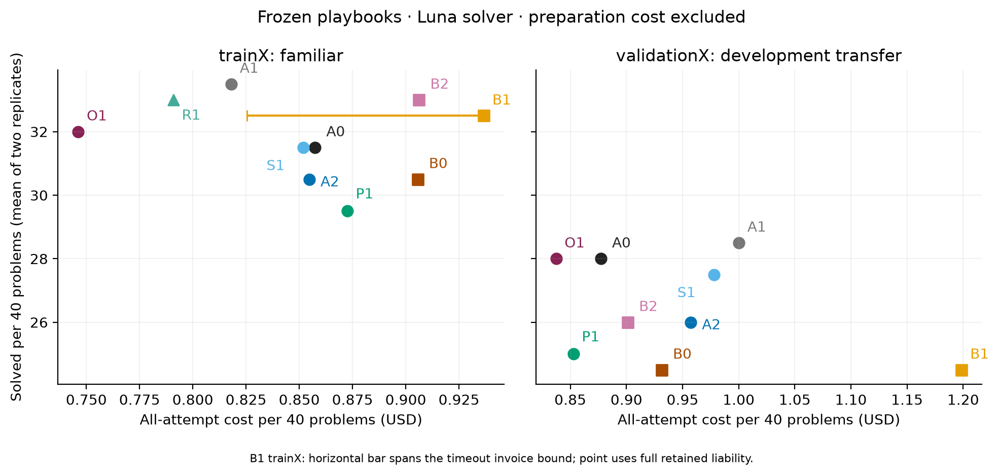
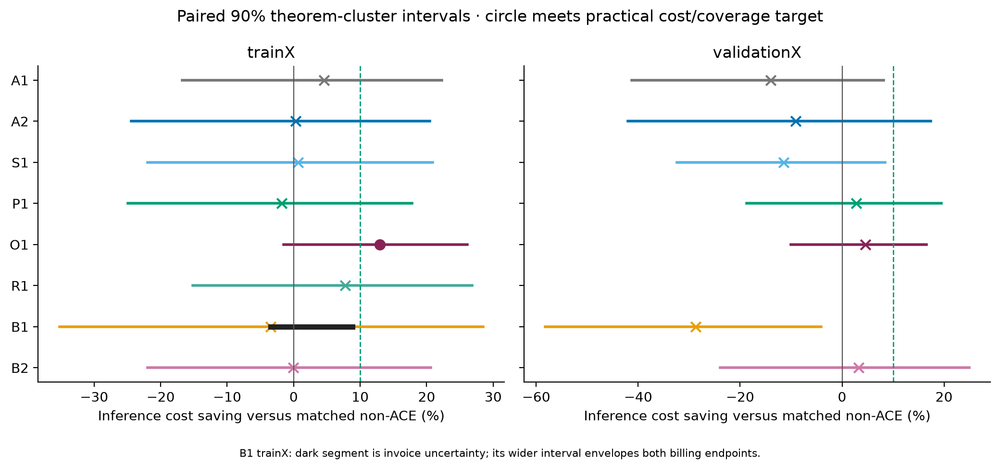
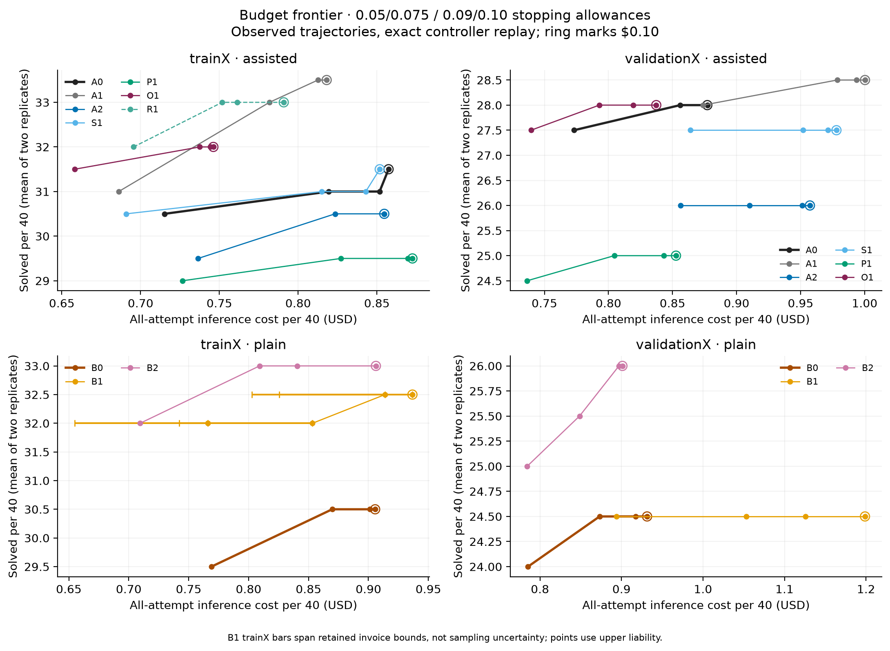
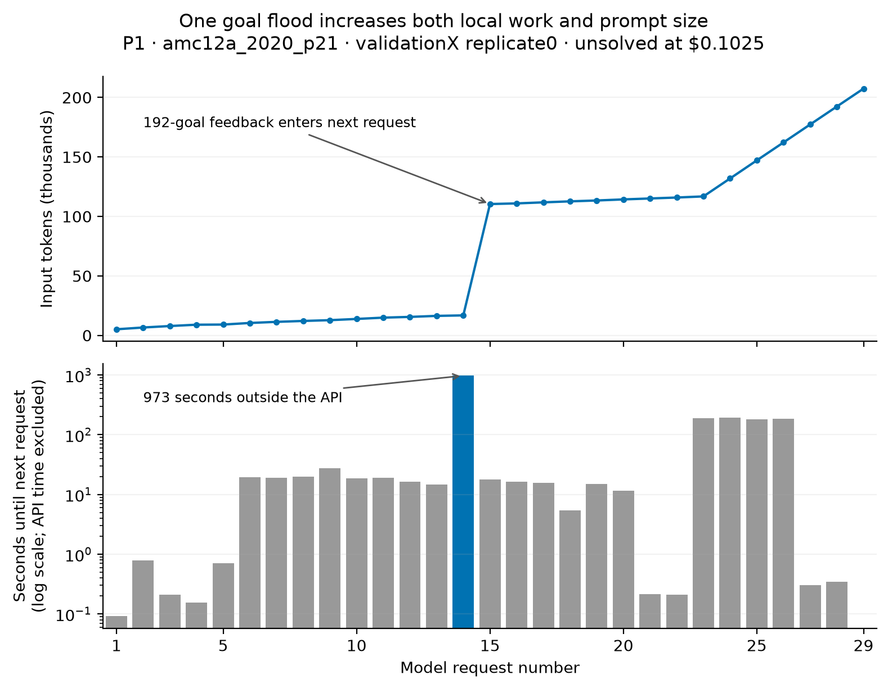

# Independent ACE investigation — final report

September 21, 2026. **All 2,044 registered solver attempts are complete. No paid experiments remain pending.** The final paid attempt finished on September 20 at 23:31 Europe/Berlin; numerical certification finished at 23:43. This report incorporates the full study, its unsuccessful variants, exact controller replays, raw-trajectory diagnoses, and executable local repairs. The [short report](short_report.md) gives the accessible assessment; the [evidence index](artifact_index.md) links the underlying artifacts.

**The strongest autonomous recipe is O1: train with an evolving playbook, then freeze it.** With Luna unchanged as solver and the same original $0.10 stopping allowance, O1 costs **12.97% less on trainX**, solving **64/80 versus 63/80** for ordinary A0. This meets the practical serving-cost objective on the familiar workload. On validationX, O1 saves **4.54% at equal 56/80 coverage**. Its $0.05 configuration saves **15.69% versus ordinary A0 at $0.10**, with **55 versus 56 solves**. The last result is an ACE-plus-budget improvement: lowering A0's own allowance already saves 11.86%, and the additional matched-$0.05 ACE saving is 4.35%.

These are measured development results, with substantial sampling and cache sensitivity. The trainX O1 saving has a theorem-cluster 90% interval of **−1.53% to +26.11%**; its validation interval is **−10.06% to +16.59%**. Passing the practical 10% threshold does not establish a general 10% effect. Conversely, those intervals do not invalidate the observed useful trade-off. A separate manual rule-repair diagnostic, R1, achieves 10.60% at a matched $0.09 allowance on trainX, with four additional solves.

The investigation explains why earlier results were inconsistent. Successful ACE trajectories often use fewer requests, but costly failures, repeated output, large verifier messages and some incorrect lessons erase those gains. Some historical comparisons also changed the controller, output allowance or baseline tools. Stronger authors improve some structural reliability measures but do not monotonically improve downstream performance. The original short-book pilot's large gain reverses on its own twelve problems under repeated draws. The completed experiments below distinguish all of these mechanisms.

Serving savings exclude a one-time frozen-book preparation fee. O1 preparation costs **$23.46235**; adding it to eighty served attempts makes the measured deployment total much more expensive than A0. The whole research bill is **$317.40916–$317.63155**, mostly learning and author-selection expenditure. These three quantities—serving, preparing a selected recipe, and running the investigation—are reported separately.

## Completed scope and accounting

A solver attempt, or cell, is one problem, variant and replicate. It can contain many model requests and proof checks. The 1,520 main attempts are not 1,520 different algorithm designs.

| Work | Completed / registered |
|---|---:|
| Main benchmark, including reused online controls | 1,520 / 1,520 |
| Three-rule R1 diagnostic | 80 / 80 |
| Adaptive frozen O1 follow-up | 160 / 160 |
| Source collection | 80 / 80 |
| Author-book pilot | 204 / 204 |
| **Total solver attempts** | **2,044 / 2,044** |

All returned provider usage has been independently repriced. Across **28,667 HTTP attempts**, 28,666 receipts are settled, including 91 rejected zero-charge requests. One earlier timeout has no returned usage and retains its entire $0.22239272 reservation as an invoice upper bound. The cost interval is **[$317.40915825, $317.63155097]**, not a claim that the upper endpoint was invoiced. No receipt remains in flight.

| Research category | Settled cost | HTTP attempts |
|---|---:|---:|
| Luna solving, including sources and author pilots | $44.51649851 | 27,575 |
| Playbook learning, audits and author selection | $270.72092774 | 1,086 |
| Six author-cache diagnostics | $2.17173200 | 6 |

The solver category additionally retains the timeout's $0.22239272 upper liability. The unknown bill affects B1 trainX only; all O1, validationX, R1 and online comparisons have exact costs. The [final economics](final_economics.json) and [receipt certification](receipt_certification.json) reconcile these totals.

The timeout is B1 trainX `mathd_algebra_185`, replicate zero. Twenty-three successful responses cost $0.03731910; request 24 timed out after 600 seconds, without a response ID. Its failed outcome remains in the denominator and its cell cost is **[$0.03731910, $0.25971182]**. Prefix/request replays reach the same terminal request. The read-only organization-usage request returned 403 for missing `api.usage.read`; response retrieval requires the missing response ID. The [billing reconciliation](billing_recovery_proposal.md) records the evidence and conservative treatment. There was no replacement draw.

The separate account-credit interruption was continued exactly after the key change. A2 trainX `amc12b_2004_p3`, replicate one, finishes failed with 23 returned responses plus one zero-charge rejection, costing **$0.10516041**. Its eight-response prefix was preserved. The first continued response had zero cache hits after the overnight gap; the actual cost is retained. A later 500,000-TPM limit interrupted 87 original trajectories. All 87 resume from certified prefixes, retaining 83 earlier paid responses. None is replaced or scored as an administrative failure. The [credit continuation](continuation_diagnosis.json) and [rate diagnosis](rate_diagnosis.json) separate those incidents from benchmark failures.

The user-requested scheduling amendment allowed four concurrent HTTP calls under a shared 400,000-token/minute target and four proof workers. It changed dispatch timing, not model, prompts, tools, stopping conditions or paid scope. The final 320 S1/O1 cells completed under that scheduler without additional rate rejections. Scheduling and account changes can affect provider caching; they are retained limitations of the later-block comparisons. Detached tmux execution preserved the same logs and receipts. The immutable source checks, exact replays and proof certification remain the basis of result quality.

## Complete frozen-book results

Each row contains the same forty problems and two paid replicates: eighty attempts, including failures. A0 is the ordinary agentic pipeline with its existing assisted checker. B0 checks the submitted script without supplying completion tactics. Each ACE arm has exactly the same tools and solver limits as its matching ordinary control. Positive savings mean the ACE arm is cheaper. Preparation is excluded from these serving tables.

### trainX: familiar-workload reuse

| Arm | Solves / 80 | Total inference cost | Cost / solve | Saving vs matched ordinary |
|---|---:|---:|---:|---:|

| A0: ordinary assisted | 63 | $1.71480 | $0.02722 | reference |
| A1: historical X5 | 67 | $1.63621 | $0.02442 | +4.58% |
| A2: full Sol book | 61 | $1.70934 | $0.02802 | +0.32% |
| S1: full Luna book | 63 | $1.70359 | $0.02704 | +0.65% |
| P1: short Sol pilot book | 59 | $1.74508 | $0.02958 | -1.77% |
| O1: adaptive then frozen | 64 | $1.49240 | $0.02332 | +12.97% |
| R1: three verified repairs | 66 | $1.58173 | $0.02397 | +7.76% |
| B0: ordinary plain | 61 | $1.81116 | $0.02969 | reference |
| B1: plain-source Sol book | 65 | $1.65099–$1.87338 | $0.02540–$0.02882 | [-3.44%, +8.84%] |
| B2: teacher-evidence Sol book | 66 | $1.81242 | $0.02746 | -0.07% |

R1 is a manual diagnostic; every other learned recipe is automatically authored. B1's cost range retains the unknown timeout bill. O1 is the only autonomous full-book arm meeting the 10% serving-cost target at the original allowance. A1 and R1 solve more familiar attempts but have smaller same-allowance savings.

### validationX: development transfer

| Arm | Solves / 80 | Total inference cost | Cost / solve | Saving vs matched ordinary |
|---|---:|---:|---:|---:|
| A0: ordinary assisted | 56 | $1.75434 | $0.03133 | reference |
| A1: historical X5 | 57 | $2.00053 | $0.03510 | -14.03% |
| A2: full Sol book | 52 | $1.91452 | $0.03682 | -9.13% |
| S1: full Luna book | 55 | $1.95598 | $0.03556 | -11.49% |
| P1: short Sol pilot book | 50 | $1.70541 | $0.03411 | +2.79% |
| O1: adaptive then frozen | 56 | $1.67464 | $0.02990 | +4.54% |
| B0: ordinary plain | 49 | $1.86280 | $0.03802 | reference |
| B1: plain-source Sol book | 49 | $2.39745 | $0.04893 | -28.70% |
| B2: teacher-evidence Sol book | 52 | $1.80229 | $0.03466 | +3.25% |

O1 is the best measured frozen-book cost/coverage choice against the stronger ordinary A0: equal solves at the lowest cost among these full-coverage candidates. P1 is slightly cheaper than A0 but loses six solves, or three per forty on average, exceeding the accepted one-to-two-problem trade-off. B2 gains three versus B0 and saves 3.25%. A0 itself is 6.18% cheaper than B0 and solves seven more attempts. The plain checker comparison is scientifically useful, but selecting it as the sole ordinary comparator would favor a weaker pipeline.

The [serving tables](serving_tables.md), [complete CSV](serving_results.csv) and [replicate CSV](serving_replicates.csv) provide every pooled result, cost per solve, theorem/family 90% interval and leave-one-theorem-out sensitivity. For example, validation savings intervals are A1 [−41.25%, +8.17%], A2 [−42.02%, +17.44%], S1 [−32.39%, +8.44%], P1 [−18.76%, +19.45%], O1 [−10.06%, +16.59%], B1 [−58.21%, −4.08%] and B2 [−23.95%, +24.94%]. They describe uncertainty rather than imposing a new passing gate.

## O1: the most promising complete ACE recipe

O1 learns through one adaptive forty-problem trainX curriculum. Luna sees the evolving playbook when generating each training trajectory; Sol-medium reflects and curates only after that task is scored. The final book is frozen for separate serving. **Order zero was selected before either curriculum finished**, not by choosing the better final result. The book contains 58 rules and 19,679 characters. The protocol, exact book and final-state provenance are preserved in [O1 results](adaptive_frozen_results.json) and the [final raw diagnosis](final_diagnosis_reviewed.json).

At the original matched $0.10 allowance, trainX A0 costs $1.71479723 for 63 solves; O1 costs $1.49239593 for 64. O1's **12.9695% saving** is not a rounded near-miss. Both replicates save money: A0's 31/$0.97873144 and 32/$0.73606579 become O1's 32/$0.77930315 and 32/$0.71309278. The pooled theorem-cluster interval is [−1.53%, 26.11%], p=0.1784; the broader-family interval is [−2.88%, 24.46%]. Leaving out one theorem at a time keeps savings positive, between 7.79% and 15.92%, but does not always retain the 10% threshold.

Validation A0 costs $1.75434101 for 56 solves; O1 costs $1.67463898 for 56: **4.5431% less**. Replicate zero becomes more expensive ($0.85130167 to $0.91506457), while replicate one becomes cheaper ($0.90303934 to $0.75957441); each side solves 28 in each replicate. The pooled interval is [−10.06%, 16.59%], p=0.5903; family sensitivity is [−4.72%, 14.04%]. Every leave-one-theorem-out saving is positive, ranging from 1.45% to 9.07%. This is a useful observed transferred result with unresolved sampling uncertainty, not an established universal reduction.

O1 also improves on A2's fixed-source Sol recipe: **12.69% less cost and three more solves on trainX; 12.53% less cost and four more solves on validationX**. Those comparisons retain wide intervals. They change the whole preparation recipe—adaptive traces, order and terminal-audit procedure—so they do not identify Generator adaptation alone as the cause.

### Where the money and solves change

Reconstructing all **320 A0/O1 raw cells** reproduces their token prices, outcomes, request counts, hashes and trace summaries exactly. On trainX, requests fall from 1,053 to 931. Input billing falls by $0.14519030 and output billing by $0.07721100. The 61 attempts both pipelines solve cost O1 $0.52780913 versus A0's $0.63176965, using 383 versus 474 requests. Fourteen shared failures become $0.05108042 more expensive. Three gained solves save $0.18529190; two lost solves add $0.01577070. The net is $0.22240130 saved.

The strongest familiar coverage gain is `mathd_algebra_185`: A0 fails both 32-request attempts for $0.16220042; O1 solves both in 26 and 20 requests for $0.10071533. Its checked proofs build a finite integer ensemble and prove membership, freshness and cardinality explicitly. O1 rules 15–16 came from this same theorem, although its adaptive source attempt itself failed after 32 requests. The source supplied useful construction work and an explicitly unverified freshness suggestion. This is evidence of reuse of intermediate progress, not proof that a particular bullet caused either success.

The biggest train cost contributor is `amc12_2000_p6`, saving $0.10073667, or 45.3% of the net saving. O1's first replicate solves in six requests using prime-divisor parity reasoning consistent with rules 26–27 learned from that same theorem. Its second replicate instead fails after 32 requests, ending in an incorrect signed divisibility equality. A0 also has one success and one failure. This paired reversal is why a favorable single trace must not stand in for the whole comparison.

On validationX, requests fall from 1,173 to 1,125. Output fees fall from $0.80561340 to $0.68260740, but input fees rise from $0.94872761 to $0.99203158. The resulting net saving is $0.07970203. Fifty-three shared successes save $0.08657596. Twenty-one shared failures save $0.00981300. Three gains save $0.05074493, while three losses add $0.06743186. O1's failed attempts still account for **70.92%** of its bill.

The transferred gains are `aime_1991_p9` replicate zero, `mathd_numbertheory_530` replicate zero, and `amc12_2001_p21` replicate one. The losses are `amc12_2001_p21` replicate zero, `mathd_numbertheory_405` replicate zero, and the product-induction theorem replicate one. The `aime_1991_p9` O1 proofs explicitly derive a trigonometric factorization and discharge the nonzero-denominator condition; both replicates solve in 13 and nine requests. Similar algebraic lessons are present in O1, but there is no randomized individual-rule ablation.

The largest validation cost saving, $0.05773604, is on `amc12a_2020_p21`, which both pipelines fail in both replicates. Thus most of the aggregate dollar advantage is reduced failure cost, not simply additional fast successful proofs. The two largest regressions are `imo_1969_p2` (+$0.07550974) and the LCM theorem `mathd_numbertheory_37` (+$0.03891004), again shared failures. Together those regressions exceed the **$0.09573207** additional saving needed to reach 10% on this panel. That arithmetic identifies where the missing margin sits; it is not a measured recovered saving.

The raw traces identify different defects on those two problems. One O1 `imo_1969_p2` trajectory records the same two-line incomplete proof in nineteen checker records; another incurs a $0.04070447 capped reply before ending with an incomplete prefix. The LCM attempts reach a 200,349-token prompt and still fail; the representation-preserving repair below already compiles the actual theorem in about 1.5 seconds. Merely providing a larger playbook does not resolve either stalled reasoning or unsafe expansion.

### Cache behavior is part of the result

O1 adds 4,807 tokens to the initial prompt. On trainX, cumulative raw input rises slightly, from 19.789 to 19.924 million tokens, but cache-read fraction rises from 90.91% to 93.77%, and output tokens fall from 737,131 to 673,804. On validationX, input grows from 21.473 to 26.659 million tokens, cache fraction rises from 90.32% to 92.78%, and output falls from 670,849 to 568,447.

Holding these exact trajectories fixed and repricing all input without cache discounts leaves only **2.19% train saving** and makes O1 **16.36% more expensive on validation**. This sensitivity is not an uncached controller experiment: different charges could stop the solver sooner. It shows that the measured operational result depends on cached serving, rather than proving a 13% reduction in raw computation. O1 ran later than its reused controls, under a different account and dispatch schedule. No warm-cache invoice adjustment or causal scheduling attribution is invented.

### Teacher evidence improves B2 relative to B1, but the ordinary comparator still matters

B2 costs $1.80228558 versus B1's $2.39744954: **24.8249% less**, with 52 versus 49 solves. Its theorem-cluster 90% interval is [5.98%, 39.87%], with unadjusted two-sided sign-flip p=0.0533; broader family sensitivity is [7.09%, 40.29%]. Excluding both replicates of the theorem with B2's context-limit failure leaves a 23.32% saving, interval [4.05%, 39.11%], p=0.0813. The original eighty-cell comparison remains the headline.

B2 gains four individual outcomes against B0 and loses one. The gains use a preserved recursive fold in a product inequality, a trigonometric factorization, square-root algebra with nonzero denominators, and Fibonacci periodicity. One gained solve is more expensive than its corresponding failed baseline attempt. Similar relevant rules already exist in B1, so matching proof text to a bullet cannot prove that a particular teacher lesson caused a gain. The [gain dossier](teacher_gain_dossier.json) retains all four gains and their provenance.

A sharper cost mechanism is repeated output. B1 emits 1,069,842 output tokens versus B2's 607,811. Non-reasoning output accounts for 421,773 of that 462,031-token difference. Twelve B1 replies hit the 32,768-token output limit, compared with two B2 replies. Their fees are $0.49004520 and $0.08070508; the $0.40934012 gap accounts for **68.78% of the total B1–B2 cost difference**. This is a measured cost decomposition, not money recovered after the fact.

### Why the full assisted book costs more

Across all eighty validation attempts, A2 increases input billing from $0.94872761 to $1.12521449 (+$0.17648688), while output billing falls from $0.80561340 to $0.78930720 (−$0.01630620). The net increase is $0.16018068. Mean initial input grows from 3,810 to 8,907 tokens. Its cached fraction actually improves, from 90.32% to 92.90%, so cache-hit percentage alone does not diagnose the regression.

Among the 52 attempts both A0 and A2 solve, A2 costs $0.365293 versus $0.48860314 and uses 292 versus 385 requests. Among the 24 attempts both fail, A2 costs $1.32525683 versus $1.16181794. The four lost solves cost A2 $0.22397186 versus A0's $0.10391993. **ACE helps on shared successes, but expensive failures and lost successes erase that saving.** A2's failures consume 80.92% of its total spend, versus 66.23% for A0.

Both replicates of `mathd_numbertheory_37` fail. Together they cost A2 $0.30433091 versus A0's $0.09159039, although A2 makes 56 requests versus A0's 64. This theorem's $0.21274052 excess exceeds A2's entire aggregate regression. Removing both matched theorem replicates leaves A2 3.16% cheaper, still with four fewer solves; that sensitivity cannot replace the full-panel result. A2's peak request reaches 512,493 input tokens. One failed arithmetic expansion produces 1,705,029 characters of verifier feedback, far larger than the book itself.

## R1: a second 10% signal from verified rule repair

R1 changes three incorrect or overbroad A2 rules after executable checks. Its full trainX result at the original $0.10 allowance is **66/80 solves for $1.58172861**, versus ordinary A0's **63/80 for $1.71479723**: 7.76% lower cost and three additional solves.

The registered lower-budget experiment replays the actual controller on those same responses. At **$0.09 for both pipelines**, R1 retains 66 solves and costs **$1.52289570**. A0 has 62 solves and costs **$1.70339228**. The saving is **10.5963%**, with four additional solves. The practical target is met on this familiar workload. The 90% interval is [−9.16%, +27.81%], p=0.4225; it is not a statistically established general effect. Leave-one-theorem-out savings range from 2.22% to 14.70%.

This result is not just a nominal budget label. Reducing R1 from $0.10 to $0.09 avoids three requests on two still-unsolved attempts, saving $0.05883291. A0 avoids one request but loses a solve on `aime_1988_p3`. The [R1 transition](../../experiments/campaigns/ace_independent_audit/r1_budget_transition.json) and [baseline transition](../../experiments/campaigns/ace_independent_audit/baseline_budget_transition.json) identify those exact cells.

One familiar theorem, `amc12_2000_p6`, accounts for $0.14608251, or **80.9% of the net $0.18049658 saving**. A0's two replicates use 23 and 20 requests; R1 uses two and five. R1's relevant prime-divisor rule already existed unchanged in A2 and was learned from that same theorem. Therefore this concentration supports familiar-workload reuse, but cannot be attributed to the three repaired rules. The [prime-divisor dossier](r1_prime_dossier.json) records the actual trajectories. The completed direct comparison is R1 66/$1.58172861 versus A2 61/$1.70933846: **7.47% less cost and five more solves** at $0.10. Its theorem-cluster 90% savings interval is [−13.66%, 23.19%], p=0.5336. This favorable observed joint result does not establish which of the three edits helped, or that they account for the prime-theorem gain. [Complete R1 comparison](rule_repair_results.json).

R1's retained context-limit failure does not manufacture the win. Excluding both replicates of its affected theorem raises the matched $0.09 saving to 12.61%. All eighty attempts remain in the primary result. The measured R1 recipe includes manual review and is not advertised as autonomous ACE.

## Budget control and ACE: two distinct contributions

The registered $0.05, $0.075 and $0.09 experiments replay the actual controller against the saved responses and verifier results; the original allowance is $0.10. All **4,560 lower-budget scenarios over 1,520 frozen cells** are certified. They make zero model calls and do not add independent samples. Costs use the actual cache invoices, including any crossing response, and are never clipped to the nominal allowance.

| Partition / arm | $0.05: solves / cost | $0.075: solves / cost | $0.09: solves / cost | $0.10: solves / cost |
|---|---:|---:|---:|---:|
| trainX A0 | 61 / $1.43028 | 62 / $1.63883 | 62 / $1.70339 | 63 / $1.71480 |
| trainX O1 | 63 / $1.31622 | 64 / $1.47520 | 64 / $1.48851 | 64 / $1.49240 |
| trainX R1 | 64 / $1.39104 | 66 / $1.50359 | 66 / $1.52290 | 66 / $1.58173 |
| validationX A0 | 55 / $1.54628 | 56 / $1.71199 | 56 / $1.75434 | 56 / $1.75434 |
| validationX O1 | 55 / $1.47902 | 56 / $1.58575 | 56 / $1.63852 | 56 / $1.67464 |
| validationX B0 | 48 / $1.57060 | 49 / $1.74626 | 49 / $1.83443 | 49 / $1.86280 |
| validationX B2 | 50 / $1.56854 | 51 / $1.69704 | 52 / $1.79381 | 52 / $1.80229 |
| validationX P1 | 49 / $1.47303 | 50 / $1.60907 | 50 / $1.68646 | 50 / $1.70541 |

The complete grid, including A1, A2, S1 and B1, is in [budget results](budget_replay_results.json) and [frontier CSV](budget_frontier.csv). Budget choices were registered before this replay; selecting the most useful point from the grid is development selection, not an untouched confirmatory comparison.

**ValidationX O1 at $0.05 saves 15.6936% against ordinary A0 at $0.10**, costing $1.47902182 versus $1.75434101 and solving 55 versus 56. Cost per solve falls from $0.03133 to $0.02689. This is within the accepted coverage trade-off. The theorem-cluster cost interval is [0.61%, 27.97%], with sign-flip p=0.1295; the family interval is [6.20%, 22.52%], p=0.0355. Bootstrap and sign-flip procedures are different tests and need not agree. Primary theorem-based inference does not establish the effect at p<0.10; the observed practical result still passes. Leave-one-theorem-out savings range from 9.43% to 19.61%.

The exact accounting decomposition is:

- Reducing ordinary A0 from $0.10 to $0.05 saves **$0.20805610**, or **11.8595%**, and loses one solve.
- Comparing O1 and A0 both at $0.05 saves another **$0.06726309**, or **4.3500% of the lower-budget baseline**, at equal 55 solves.
- Together these changes save **$0.27531919**, or **15.6936% of the original baseline**. Percentages with different denominators must not be added directly.

At $0.075 O1 retains 56 validation solves and costs $1.58575407. Against original A0 this saves 9.61%, just below 10%; against A0 at the same allowance it saves 7.37%. At matched $0.09 it saves 6.60%; at matched $0.10, 4.54%. No tested allowance yields a 10% isolated O1 saving on validationX. The useful 15.69% joint result is reported without attributing all of it to ACE.

On trainX, O1 at $0.05 saves **23.24% versus original A0**, at equal 63/80 coverage. Its theorem-cluster interval is [10.78%, 33.44%], p=0.0153; family sensitivity is [8.58%, 32.38%], p=0.0448. Against A0 at the same $0.05, the saving is 7.97%, with two extra solves. At matched $0.075 it is 9.9847%, which must not be rounded into a 10% pass; matched $0.09 gives 12.61% with two extra solves. These are familiar-workload controller results, not new deployment samples.

B2 at $0.05 is 15.80% cheaper than B0 at $0.10 and solves one more attempt. B0's own lower allowance captures almost all that saving: the matched-$0.05 ACE contribution is just 0.13%. P1's cheaper settings retain the same six-solve validation deficit against A0. A joint configuration improvement and a same-controller ACE improvement answer different questions; both are retained.

The [final diagnosis](final_diagnosis_reviewed.json) records both joint comparisons, their theorem/family uncertainty and exact dollar decompositions. A lower allowance is a functioning budget treatment, not proof that every dollar of a failed trajectory could be removed without altering future behavior.

## The short-book pilot did not reproduce its initial advantage

P1's original twelve-problem pilot solved 11/12 versus 9/12 and saved 57.41%. Its full trainX follow-up instead solves **59/80 for $1.74508150**, versus ordinary A0's **63/80 for $1.71479723**: 1.77% more cost and four fewer solves. Its full validation result is the 2.79% saving with six fewer solves above.

The failure is visible even on the same twelve pilot problems. Across their two new replicates, P1 solves 16/24 for $0.56653286; A0 solves 21/24 for $0.38117011. P1 is **48.63% more expensive**, with five fewer solves. All 48 corresponding initial requests match the original pilot requests exactly. This directly rejects an explanation based only on changing the problem set or initial prompt. The new draws and subsequent trajectories differ; pilot selection favored an unusually good observed sample.

On the other 28 train problems, P1 does save 11.63% and gains one solve, but selecting that favorable subset would discard the observed reversal on the pilot set. The [complete repeat diagnosis](pilot_repeat_diagnosis.json) preserves every subset and raw source hash. Compact context remains a reasonable mechanism to study; the actual P1 book is no longer justified as the lead full-panel candidate by its selected pilot alone.

## Both online curricula are complete

Every current score was committed before learning from that task. The two curricula have 400 solver attempts including shared ordinary controls, with eighty completed updates. The [chronology certificate](online_chronology.json) verifies empty starting books, exact preceding states and train-only learning evidence.

| Pipeline | Solves / 80 | Solver inference | Learning updates | Operational total |
|---|---:|---:|---:|---:|
| A0 | 63 | $1.71480 | — | $1.71480 |
| online A2 | 64 | $1.62155 | $40.84603 | $42.46759 |
| B0 | 61 | $1.81116 | — | $1.81116 |
| online B1 | 64 | $1.73315 | $53.88801 | $55.62116 |
| online B2 | 64 | $1.79180 | $56.46660 | $58.25840 |

Solver-only savings are 5.44%, 4.31% and 1.07% respectively. These are promising directions in cost and coverage, but not 10% serving-cost results; frequent strong-model updating dominates total operating cost on this workload. The theorem-cluster intervals all cross zero. Because each learned state depends on earlier tasks, two order realizations are also not forty independent learning experiments. O1 evaluates the already frozen final book separately from the cost of updating after every served task.

## Executable diagnoses of the expensive failures

These are local mechanism experiments. They keep the recorded benchmark outcomes, frozen books and learning inputs unchanged. A hand-repaired proof demonstrates a correct repair route, not that Luna would autonomously discover it.

### Large-number LCM: preserve the representation

For `Nat.lcm 9999 100001 = 90900909`, the paid trajectory already established the gcd and division facts. Expanding unary multiplication then caused enormous proof-state text. Keeping that prefix, importing `DecimalNat` inside the proof, normalizing the structural decimal representation and applying `nia` closes the original theorem. Independent compilation takes **1.45 seconds**; the actual ordinary unassisted bridge accepts it in **1.69 seconds**, with no automatic completion, under the original tactic limits and 4 GB worker limit. [LCM repair certificate](lcm_repair_certification.json).

The meaningful lesson is not a broad instruction to increase context or spend more reasoning. It is a representation-specific repair: normalize compact decimal structure before invoking arithmetic, retaining the verified gcd/division work. This directly diagnoses the theorem that erased A2's aggregate savings.

### A nearly finished induction became a multi-megabyte error

P1 and B2 both reach a valid induction on validationX `amc12a_2008_p4`, then end with `cbn in H; exact H`. That reduction expands a 501-factor product. Their feedback reaches 3,329,613 and 3,329,453 serialized characters; the error message alone contributes about 2.22 million characters. The next provider request is rejected for context length.

Replacing just the final two tactics with `eapply eq_trans; [exact H |].`, then `rewrite INR_IZR_INZ.` and `ring.` compiles both original proof candidates in **0.82 and 0.79 seconds**. [Context repair certificate](context_repair_certification.json). The three retained context-limit failures, including R1's separate case, keep their paid prefixes and failed outcomes. Their rejected calls cost zero; none is replaced by a favorable draw.

The implementation's goal caps bound rendered remaining goals but do not bound `error_message`. Capping only the number of displayed goals therefore cannot prevent this failure. Any feedback bound must cover the whole serialized payload while preserving the full checker result. The diagnostic repair additionally avoids generating the huge term at all.

### A goal flood wastes local work and creates later API cost

P1's validation `amc12a_2020_p21` replicate zero proposes a list of 192 values, containing only 48 distinct values repeated four times, for a `NoDup` argument. Its uniqueness obligation is false; a symbolic duplicate witness is independently compiled. A first concrete inversion attempt overflowed the stack and is preserved as a failed probe.

The unassisted check exposes 192 goals in 1.52 seconds. In the paid assisted trajectory, the interval after this reply and before the next API dispatch is **973 seconds outside the API**. The full worker lasts 2,102.72 seconds; API requests account for 136.44 seconds. The rest must not be described as model latency. The next input jumps from 16,798 to 110,412 tokens, with 236,130 feedback characters. The worker eventually fails after 29 requests and $0.10250013. [Timing and proof evidence](goal_flood_timing.json), [compiled duplicate witness](goal_flood_witness_certification.json).

### Repeated fenced proofs are sometimes parsed as an empty proof

All **27** capped replies in the original seven validation panels (A0, A1, A2, P1, B0, B1 and B2) are examined. This census has that explicit scope; the later S1/O1 panels are not silently included in its denominator. Twenty-five repeat one identical complete typed proof 26–94 times; the other two repeat several different blocks. The legacy overlapping code-fence extractor returns an empty string in **23/27**, despite complete proof blocks being present. A closing fence is treated as another opener, and the blank gap before the next block becomes the last match.

The local replacement selects an explicitly typed, complete Rocq/Coq block. All 27 extracted candidates are independently compiled: **one passes and 26 fail**. The failed checks remain reported. A read-only retrieval of one B1 response confirms that its 91,617 characters and forty repeated proof blocks are byte-identical to the provider's stored message. The repetition is present in a single provider response, rather than being introduced by concatenating local requests. [Repetition diagnosis](output_repetition_diagnosis.json), [provider check](output_repetition_provider_check.json).

The valid discarded proof belongs to ordinary A0 on `imo_1964_p2`, replicate one. Its original run finishes after sixteen requests for $0.07685063. Correcting only the extraction of reply fifteen, with earlier responses fixed, makes the actual controller and local Rocq check finish after fifteen requests for **$0.06716406**, saving the following **$0.00968657** request. The same HTTP-disabled test succeeds at $0.10, $0.09, $0.075 and $0.05. At $0.05, the original recorded controller failed at that same $0.06716406 cost; corrected extraction recovers the solve without extra spending. [Parser/controller certificate](parser_replay_certification.json).

The already emitted 32,768 tokens are still fully charged. This repair is shared solver infrastructure, not ACE credit. The diagnostic does not replace outcomes or simulate all future feedback from a generally changed parser. The tested local extractor and replay are supplied without changing the paid comparison mid-study. All paid attempts have now finished under their recorded original contract. A generic stdlib repair lies outside the authorized edit scope and is documented as a suggestion.

### A missing dependency, rather than more broad proof search

On trainX `aime_1988_p8`, P1's second proposal already had seven recurrence equations. It omitted one required symmetry fact. Adding only `pose proof (Hsym 10%nat 4%nat P10 P4) as H11.` before the existing simplification and `nra` compiles the original candidate. The paid trajectory instead exhausted 32 requests. [Dependency repair](pilot_dependency_repair.json). This supports recording the exact prerequisite chain and verified repair, rather than merely recommending an arithmetic tactic.

## What is being reproduced

The thesis target is **at least 10% lower total inference cost than the equivalent ordinary agentic pipeline**, allowing up to two fewer solved problems per forty on average. Cost includes unsuccessful attempts. Learning and preparation are reported separately for a frozen playbook, and included in operating cost for online learning. A coverage improvement is also valuable; there is no requirement that every replicate individually avoid losing a problem.

This is an adaptation of ACE to Rocq, rather than an exact reproduction of its original benchmark. The local reference is [ACE, version 3](../../papers/2510.04618v3.pdf), also available [from the authors on arXiv](https://arxiv.org/abs/2510.04618). Section 4.1 distinguishes two experiments:

- Offline: learn the context on training problems, freeze it, and evaluate on other problems.
- Online: solve the current problem with the current context, record its score, then learn from that problem before proceeding. All compared methods see the same order.

Therefore **benchmarking trainX is appropriate**. A frozen book tested on its training problems measures familiar-workload reuse. An empty-start online curriculum measures performance before learning from the current sample. These are different claims and are reported separately. ValidationX measures development transfer; its repeated historical use means it is not an untouched confirmation set. No closed evaluation partition, protected challenge problem, or mixed results artifact was opened for this investigation.

The paper's main experiments use the same DeepSeek-V3.1 model for Generator, Reflector, and Curator, with maximum five epochs and five reflection rounds (§4.2). Its fine-grained cost study uses one epoch and one reflection round (Appendix A.3). Its stronger-Reflector ablation varies only that role: FiNER accuracy is 70.7 for the base model, 76.6 with GPT-OSS reflection, 78.3 with DeepSeek reflection, and 78.5 with GPT-5.1 reflection (Table 16). Our scaling experiment keeps **Luna as the solver** and varies the models used for reflection, curation, and terminal auditing together. It tests the authorized stronger-author recipe, not the paper's isolated Reflector ablation.

The paper does not establish a universal 10% serving-cost reduction against ordinary ReAct. Table 14 reports 27,460,411 input tokens, 289,802 output tokens, and 2,430 rollouts for Base ReAct, versus 58,623,267, 270,652, and 2,354 for ACE over 160 evaluation queries. Its printed percentage comparisons are against GEPA. The prominent adaptation savings in Table 4 are also against GEPA or Dynamic Cheatsheet. The 82.6% figure in §4.7 is **input-billing savings from caching relative to charging raw input tokens**, not total-cost savings against the ordinary agent. These distinctions determine the right denominator; they do not invalidate the thesis objective.

## Experimental contracts

All new benchmark solving uses Luna, medium reasoning, the Responses API, a 32-request allowance, a $0.10 stopping budget, and a 32,768 output-token limit. The two tools are `ReadSkill` and `SearchRocq`. The current problem's informal proof sketch and definitions are available, and the original two fixed tool-use demonstrations are retained. The baseline is therefore not theorem-only prompting. Empty ACE context renders exactly the ordinary agentic system and instance prompts; an offline contract test verifies this equality.

| Arm | Solver/checker | Playbook preparation |
|---|---|---|
| A0 | Original assisted verifier | No playbook |
| A1 | Same as A0 | Historical X5, rendering version 2 |
| A2 | Same as A0 | Forty fixed assisted trajectories; Sol authors; five terminal audit batches |
| S1 | Same as A0 | Same trajectories/order/procedure as A2; Luna authors |
| P1 | Same as A0 | The actual eleven-bullet Sol book selected by the eight-source author pilot |
| B0 | Plain verifier | No playbook |
| B1 | Same as B0 | Forty fixed plain trajectories; Sol authors; five terminal audit batches |
| B2 | Same as B0 | Same plain trajectories, augmented with training-only automatic completion evidence |
| R1 | Same as A0 | A2 with three manually audited tactic claims repaired; trainX diagnostic only |
| O1 | Same as A0 | Final book from the first adaptive online curriculum, frozen after forty updates |

The assisted verifier can supply closing tactics. The plain verifier checks the submitted proof and supplies no completion. B2's extra completion work happens **after collecting a training trajectory** and never improves a benchmark score directly. The A and B comparisons each have their own matching non-ACE control. The comparison A0 versus B0 studies the effect of assistance itself.

The initial frozen matrix contains eight arms × forty problems × two replicates × two partitions: 1,280 attempts. Three additional online ACE arms each run forty problems in two independently shuffled trainX orders: 240 attempts. Their no-ACE controls are the same 160 trainX A0/B0 attempts already included in the frozen matrix. That study contains **1,520 attempts**, with no duplicate controls. The original core is 1,200; S1 and P1 are separately registered 160-attempt follow-ups. Two subsequent diagnostics add eighty R1 trainX cells and 160 O1 trainX/validationX cells, reusing the same controls. Source collection adds eighty cells and the author pilot adds 204, for **2,044 registered solver cells overall**. Deterministic cache replays and synthetic tactic probes are separate checks, not extra independent benchmark samples.

The `seed0` and `seed1` names identify independent paid replicates and online orders; they are not a promise of deterministic provider seeding. Pairing matches theorem and replicate. For complete pooled panels, confidence intervals resample forty theorem clusters, retaining both replicates together; a second analysis uses broader proof-method families. The earlier single-replicate checkpoint is preserved separately. The proof-method families are deliberately conservative groups, not claims that all their members are duplicate statements. None of the eighty allowed statements was an exact duplicate under the inspected numeral/single-letter normalization.

The practical target is evaluated separately from statistical support. A 90% interval and a two-sided sign-flip result describe uncertainty; neither is a veto on an exploratory follow-up. Selection among several candidate books makes the author pilot exploratory, even when its unadjusted interval is favorable. The reports show both the complete cost/coverage trade-off and individual problem contributions.

### Important differences from the paper

The full offline preparation uses fixed source trajectories to isolate author and teacher changes. Its Generator does not solve each subsequent training problem with the evolving book. The online track separately tests that interaction. Consequently, helpful/harmful tags in fixed-source preparation are retrospective judgments about compatibility with a trace, not direct observations that the Generator used an evolving bullet.

The implementation uses deterministic incremental ADD merges with lexical deduplication and source-linked terminal revisions. It does not reproduce the paper's embedding-based deduplication or Generator-side bullet attribution. The nominal book cap is a 6,000-token **character-based estimate**, not an exact tokenizer limit. No full-training ADD reached that cap, and lexical deduplication merged zero bullets in each of the four full recipes. Terminal auditors receive checks, returned scripts, reflections, and deltas grouped into five batches of eight sources. Reflectors and curators receive the fuller version-2 evidence, including the informal sketch and visible tool conversation. These input contracts must not be described as identical.

P1 versus A0 changes only learned context at inference. P1 versus A2 compares complete preparation recipes: source count, curriculum order, and terminal refinement all differ. A favorable P1 result alone is not a causal estimate of shortening a forty-source book.

O1 addresses the distinction between fixed-source learning and adaptive training directly. It takes the final assisted book from online order zero, selected before either curriculum finished, and evaluates it as a frozen artifact. This is a one-epoch adaptive Generator/Reflector/Curator preparation recipe. Its comparisons with A2 or P1 include differences in source trajectories, order, and terminal auditing; they do not isolate only Generator adaptation. R1 is a manual rule-quality intervention, not an autonomous learning recipe. S1, P1, R1, and O1 reuse earlier compatible controls and were dispatched in later blocks, so their comparisons also retain temporal and provider-cache limitations. Raw-token repricing is reported as a sensitivity analysis, not as a simulated uncached deployment.

## What the historical evidence actually shows

The census was reconstructed from **10,110 permitted raw result cells across 81 archives**, plus 153 exception-only cells. It did not use old verdicts or handoff conclusions. The 848 descriptive solver labels include small pilots and evolving books; they are not 848 complete independent benchmarks. The full census, executable contracts, missing cells, learning-role groups, and matched comparisons are linked in the artifact index.

Seventy-three interrupted cells had explicit continuation policies whose final caches contained every saved prefix entry exactly. Those prefixes were replayed, not purchased twice. Naively summing both archives adds $0.64806857 of duplicate recorded calls. The reconciled analysis removes that duplication while preserving the interrupted files. It makes no zero-bill assumption about missing transport metadata.

Historical dollar figures are recomputed at the common September 19 tariff, including cache writes, rather than copied from archived `price` columns. They are normalized comparison costs, not reconstructed historical invoices. Fresh experiment figures are checked against raw provider responses and the new ledger. Failed calls and failed problems remain in the relevant accounting and denominators.

### Several different baselines had become mixed together

The original experiments used `prove_theorem_agentic`/`prove_theorem_ace`, two core tools, and 32 requests. Later experiments used `prove_theorem_grounded`, 64 requests, `InspectProofState`, focused decision prompts, bounded goal views, and 300 seconds of verifier work. Those later ACE/non-ACE pairs can be valid within their own contract, but they do not reproduce the original agentic experiment simply because a campaign name contains “X3 reproduction.”

This distinction changes the interpretation of apparently promising numbers. The historical session-matched comparison has 50/80 solves on each side and 11.19% lower ACE inference cost; its theorem-cluster 90% interval is −0.32% to 21.44%. Against that campaign's ordinary non-reset baseline, the same ACE-session configuration saves only 1.05%, while improving 47 to 50 solves. Both results matter. Selecting the more expensive reset control as the sole headline comparator would answer a different question.

After exact-prefix reconciliation, the September 18 thesis-selected book has 51/80 solves at $2.25622. Its output-cap-matched non-ACE control has 49/80 at $2.41161: 6.44% savings. The ordinary 32,768-output-token control has 51/80 at $1.71575, making that ACE recipe 31.50% more expensive. Thus the apparently small output cap did not make this solver cheaper. In the later X3 reproduction, the matched 32,768-cap comparison is 46 to 50 solves and 4.78% savings; the 8,192-cap comparison is 51 to 45 solves and 0.94% higher cost.

### Why a smaller output cap increased the historical bill

The output-cap discrepancy is checked directly against all 320 permitted validationX cells of `ace_x3_reproduction_20260918`, their raw cache/result hashes, and 4,551 recorded admission estimates. The comparison changes the output allowance within its original bounded grounded contract; it is separate from the new 32-request A0/O1 study.

| Historical arm | Output cap | Solves / 80 | All-attempt cost |
|---|---:|---:|---:|
| Ordinary | 32,768 | 46 | $1.67164672 |
| Ordinary | 8,192 | 51 | $2.35926838 |
| X3 | 32,768 | 50 | $1.59180079 |
| X3 | 8,192 | 45 | $2.38133537 |

At the same 32,768 cap, X3 saves **4.78%**, with four more solves; its 90% interval is [−5.35%, 13.81%]. Comparing X3 at 32,768 with ordinary at 8,192 instead gives **32.53% less cost and one fewer solve**, interval [24.06%, 39.48%]. That is a useful observed joint configuration result, but the apparent 32.53% must not all be assigned to ACE. Reducing the output cap increases ordinary spending by 41.13% and X3 spending by 49.60% in this controller.

The recorded admission rule explains the apparent paradox. It estimates the next request using the output allowance. Reducing that allowance from 32,768 to 8,192 decreases the admission estimate by **$0.0294912**, letting more requests enter before stopping. For 462 low-cap admissions across 53 cells, the same recorded input and remaining budget would fail the high-cap admission estimate. After each affected cell's first such denial, the actual low-cap trajectories contain 466 paid responses costing **$1.41895202**. This is a conditional audit of admission decisions; it does not simulate alternative model outputs or attribute the whole observed difference to those tail calls. The [output-cap diagnosis](reproduction_output_cap_diagnosis.json) preserves all input hashes and the explicit counterfactual boundary.

Earlier code also imposed zero loss in each replicate in some economy gates. That requirement is visible in the experiment source and is stricter than the user's objective. This investigation preserves those original protocols as history, but evaluates the requested average trade-off. Removing a mistaken gate does not turn a measured 1–6% saving into 10%; it does prevent discarding useful candidates merely because one replicate loses a proof.

### The cost problem is dominated by unsuccessful trajectories

For the original validation baseline, 26 failed attempts cost $1.24767213 of $1.77504503 total: **70.3% of all inference spending**. X3 rendering version 2 solves two more attempts, but its 24 failures cost $1.75294794 and its total rises to $2.32188362.

Two X3 failures alone cost about $0.6946. The `amc12a_2019_p21` replicate reaches 778,447 input tokens in one request and emits roughly 1.04 million characters of verifier feedback; the `mathd_numbertheory_37` replicate reaches 522,325 input tokens and roughly 1.68 million feedback characters. The ordinary baseline also has an expensive `amc12a_2020_p21` trajectory, costing $0.20795 and reaching 451,768 input tokens. Repeated expanded proof states accumulate in the conversation and can cross the long-context tariff boundary. This is a trajectory-control problem as well as a playbook-size problem.

Prompt caching is already effective. The original baseline serves 90.28% of input tokens from cache, X3 rv2 89.25%, and X5 rv2 93.28%. Their input bills are $1.01021, $1.52152, and $0.95146 respectively. X5 reads about 20% more raw input than the baseline but pays less for input. Conversely, the successful Sol pilot has a slightly lower cache fraction than its control, 90.97% versus 92.45%, while reducing cumulative input from 4.093 million to 1.255 million tokens and output from 95,510 to 52,328 tokens. The measured pilot gain accompanies shorter trajectories, not improved cache hit rate.

The $0.10 allowance is a stopping threshold checked between requests, not a hard bill ceiling. A single crossing request can overshoot it. Costs are not clipped at ten cents in these results.

## Implementation defects and controlled diagnostics

### Serialization failures were being mistaken for learning behavior

The two monolithic historical adaptations contain eighty rewrite steps and 196 model replies. Only 35 steps produced a usable result. All 161 invalid replies encountered the same YAML error class: unquoted scalar text containing a colon in Rocq syntax, such as an assertion type annotation. An offline transformation that quotes only unquoted single-line `content` scalars makes all 196 saved replies parse and all eighty steps usable. The 35 originally valid parsed values remain identical.

This experiment uses no new model calls and does not change any archived score. It establishes that these ablations cannot cleanly attribute their outcome to conceptual “context collapse”: much of their learning pipeline never accepted the returned text. It does not establish the coverage an adaptively rerun monolithic learner would have obtained.

The new author ladder exposed a second parser problem: the old last-code-block extraction sometimes selected an indented Rocq fence inside a YAML block scalar. The version-3 parser recognizes the outer column-zero serialization fence. On all 266 saved author replies it recovers 266 valid outputs versus 254 for the old parser, preserving all 254 common valid values. The failed extractions caused ten extra requests and two wholly lost role outputs. The full preparation and online study use the repaired parser; the earlier pilot books remain the artifacts actually produced, so their parser failures remain a limitation when comparing author capability.

The census also finds 54 historical curator exceptions caused by a template expecting a missing `theorem` field. They are concentrated in the early offline-three-epoch and warm-online adaptations. They are preparation failures, not evidence that a correctly executed ACE update was ineffective. The current versioned role queries and templates have explicit input contracts; sealed historical strategies and caches are preserved.

### Stronger authors help with some errors, but still need verification

All four full preparations completed eighty reflection/curation outputs plus five terminal audits. Sol's A2, B1, and B2 growth phases produced no unknown-ID merge warnings. Luna's S1 emitted seventy bullet tags, of which 42 referenced nonexistent IDs and were ignored by the deterministic merge. This measures structured-reference reliability under the shared prompt contract, not general model capability. The prompt requests bullet IDs but could state the restriction to existing IDs more explicitly. The matched S1/A2 benchmark measures the resulting books' practical value.

The completed matched full-book comparison does not show a monotonic downstream advantage from Sol. On trainX, Luna-authored S1 gives **63/$1.70358556**, versus Sol-authored A2's **61/$1.70933846**. On validationX, S1 gives **55/$1.95597527**, versus A2's **52/$1.91452169**: Sol is slightly cheaper but solves three fewer attempts. Neither reaches a 10% serving saving against A0. S1 preparation costs $1.75535689 versus A2's $21.16027059, **91.70% less**, so inexpensive authoring materially changes amortization even without winning the serving benchmark. Stronger models remain useful preparation candidates, but the measured case for O1 is its complete adaptive recipe, not model size alone.

Ten synthetic Rocq probes independently check specific learned claims:

- `nra` proves a simple variable square nonnegative, but fails on the tested affine and product-square expressions. Explicit `Rle_0_sqr` proofs close both compound cases. The old square advice is too general as phrased, while its fallback is useful.
- In the same Rocq file, `About vm_compute` reports no defined object and `vm_compute; reflexivity` successfully proves a closed equality. Object introspection does not test whether a built-in tactic is available. A new Sol reflection and terminal rationale made precisely this mistaken inference.
- The rejected unparenthesized `set x := ...` form has a working parenthesized `set (x := ...)` counterpart. The historical named-`pose` workaround is valid too; it must not be called false merely because another repair exists.
- `field` alone does not prove the tested logarithmic denominator identity. Rewriting the power logarithm and then using `ring` does. Here the learned algebraic repair is substantively wrong for the stated transcendental relation.

These checks distinguish safe but overly broad guidance, incorrect causal explanations, and actually failing repair advice. They also show why a larger author model alone does not certify a rule's correctness. The report does not infer bullet-level causal effects from a solver merely producing a proof consistent with the book.

Six additional synthetic checks expose a more direct failure in the new long book. A2 bullet 58 prescribes `unfold Same_set; intro x; split`. In this library, `Same_set` unfolds to a conjunction of two inclusions. The prescribed sequence fails with “No product even after head-reduction”; splitting before introducing the element compiles. A2 bullet 24 prescribes an untargeted `Rabs_right` rewrite. Under precisely its advertised assumptions, that rewrite fails because it first tries to establish the unknown sign of the left-hand variable. Targeting the right-hand expression with `rewrite (Rabs_right c) by lra` works. A quantified positive-multiplication example also shows that bullet 9's blanket warning against `nra` is too broad, while its explicit monotonicity lemma remains a useful fallback. The sixth check confirms the short P1 book's product-form square assertion.

The provenance of the set-equality error is particularly informative. The assisted `mathd_algebra_224` source run failed after 32 requests. Its reflector offered an unverified repair, the curator described it as directly established by verifier evidence, and the terminal auditor retained it with an incorrect causal explanation. Luna's S1 book contains the same tactic-order error. B1 and B2 instead prescribe the correct split-first sequence: their shared plain source also failed overall, but it had successfully passed this intermediate repair. Thus an unsuccessful trajectory can contain useful verified progress, while an author's explanation of a failed step can still be false. Correctly checking the final proof does not automatically validate the lesson extracted from it.

R1 freezes those three A2 repairs and measures their joint effect on all forty trainX problems with two replicates. Its 80-cell diagnostic separates the claim “these recipes are corrected” from the separate empirical claim “the corrections make this solver cheaper or more successful.” The original paid books and outcomes remain intact. Early drafts of these six probes omitted the domain imports; those missing-symbol failures are preserved and explicitly excluded. The sixteen reported probes use the appropriate imports.

### Completion and accounting must be explicit

During this investigation, a preliminary author assessment was made too early because Delphyne periodically writes intermediate `result.yaml` files. The provisional conclusion favored Luna; the completed pilot favors Sol. The premature artifacts are preserved in an incident directory. The prematurely queued online launches made zero API calls and consumed no benchmark attempts.

The correction is implemented in a campaign-local launcher adapter: a completion receipt is written only after the worker returns, and it hashes both result and cache. Analysis also requires the launch lock to be released and final experiment state to be complete. Source and pilot results have exact HTTP-disabled replay certificates and independent Rocq compilation certificates; the same certification is applied to the final study. Existing shared and sealed launchers were not silently rewritten. A general completion-receipt interface is an out-of-scope suggestion for Delphyne itself.

## What the author and teacher pilots establish

The author study holds eight trainX source trajectories fixed and compares Luna, Terra, Sol, and Astra at medium and high reasoning. The first evidence encoding omitted the informal sketch and tool replies. A second encoding restores the solver's visible inputs and conversation. Both sets of books and their matched twelve-problem pilot evaluations are retained: seventeen arms including the no-book control, 204 attempts total.

With full-input evidence, Sol-medium solves 11/12 at $0.11395045, versus the ordinary control's 9/12 at $0.26757794: **57.41% lower inference cost**. Luna-medium solves 10/12 at $0.15631995. Sol-high is worse than Sol-medium in this pilot, and Astra-high costs more while matching Sol-medium's eleven solves. More model capacity or more reasoning is not monotonically better.

| Author model / reasoning | Luna solves / 12 | Luna pilot inference cost |
|---|---:|---:|
| No playbook | 9 | $0.26757794 |
| Luna / medium | 10 | $0.15631995 |
| Luna / high | 10 | $0.21146018 |
| Terra / medium | 10 | $0.24370943 |
| Terra / high | 11 | $0.24557885 |
| Sol / medium | 11 | $0.11395045 |
| Sol / high | 9 | $0.21016275 |
| Astra / medium | 10 | $0.25099609 |
| Astra / high | 11 | $0.20929285 |

This table reports the full-input-evidence pilot. The first evidence encoding and every authoring charge remain in [author selection](../../experiments/campaigns/ace_independent_audit/author_selection.json) and [author economics](../../experiments/campaigns/ace_independent_audit/author_ladder_economics.json). The solver is Luna in every row. Sol-medium was selected from these results; the later full P1 evaluation is the appropriate check of that selected pilot signal.

Three pilot problems overlap the eight source trajectories. On the remaining nine, the control solves six at $0.24992996 and the Sol book solves eight at $0.10605873, a 57.56% saving. This reduces the concern that the pilot result is entirely familiar-problem recall, but the pilot remains selected, small, and exploratory. P1 freezes that actual 3,986-character, eleven-bullet book before its full trainX/validationX follow-up.

The per-problem traces explain the pilot difference. On `amc12a_2002_p13`, the control exhausts 32 requests and 23 checks without a proof; Sol's book leads to a checked product-zero factorization in fourteen requests and seven checks. On `mathd_numbertheory_629`, the control fails after 32 requests, while the Sol-book trajectory solves in eighteen using explicit closed LCM replacements after still encountering stack overflows. On `amc12b_2004_p3`, both paths bound exponents and split cases, but Sol's book uses eight requests versus thirteen. Its accepted script contains seventy verifier-supplied `easy` closures: these are genuine checked assistance, not seventy subgoals independently solved by Luna. Easy one-request problems can instead pay extra prompt cost. Here and in the trace tables, “checks” counts distinct cached compute records; cache reuse means this is not necessarily every invocation or every low-level Rocq request.

The training-only completion teacher performs 339 checks on the forty fixed plain trajectories, finds eleven independently rechecked and kernel-compiled scripts on nine theorems, and encounters six work-limited checks. **None of its successful completions comes from a source theorem the plain solver ultimately failed.** It can expose shorter completions and useful intermediate repairs, but this measured teacher did not supply new solved examples for the hardest failures. B1/B2 therefore tests a specific limited source of supervision, not an unlimited oracle.

The retained-rule provenance also identifies a mismatch between training effort and the economic objective. A2's seven failed source problems consume $0.39363 of $0.75239 source spending (52.3%), but introduce twelve of its 57 retained rules and only 19.2% of their content characters. Five one-request successes consume $0.00231 and introduce five rules. B1's nine failures account for 59.9% of source cost and fourteen of 53 retained rules. The short P1 book's eleven rules all originate in seven multi-request successes; its eighth, one-request source contributes no rule. These are source-allocation measurements, not estimates of rule usefulness. They support testing a learning objective that explicitly targets expensive recoverable trajectories, while the compiled set-equality example shows why failed-source lessons still need executable evidence.

## Preparation economics

| Recipe | Source collection | Author and audit calls | Total preparation | Frozen bullets / characters |
|---|---:|---:|---:|---:|
| A2: full Sol, assisted | $0.75239 | $20.40788 | $21.16027 | 57 / 21,079 |
| S1: full Luna, assisted | $0.75239 | $1.00297 | $1.75536 | 57 / 18,938 |
| B1: full Sol, plain | $0.99151 | $26.58647 | $27.57798 | 53 / 18,669 |
| B2: full Sol, teacher evidence | $0.99151 | $43.72839 | $44.71990 | 61 / 21,174 |
| P1: short Sol pilot book | $0.07698 | $2.02092 | $2.09790 | 11 / 3,986 |
| O1: adaptive then frozen | $0.83458 | $22.62777 | $23.46235 | 58 / 19,679 |

These are deployment-recipe costs: each includes the sources it needs. The investigation reuses source trajectories, so adding all table rows would double-count the study bill. If suitable source trajectories already exist, the incremental preparation charge is the author/audit column. The teacher has zero additional LLM API cost for its deterministic proof work, but its longer evidence increases author input cost; measured completion/check/compilation time is reported separately without inventing a machine-dollar tariff.

B2's larger fee has a measurable mechanism. Its authors read 7,511,433 input tokens versus B1's 4,961,585, and two B2 requests cross the 272,000-token tariff boundary, with a maximum of 466,925 tokens. Their output counts are almost unchanged: 88,614 versus 88,940. B2's billed input rises from B1's $24.80767 to $41.91091. The extra teacher evidence therefore increases both volume and, for two requests, the per-token tariff; it is not primarily extra author output reasoning.

O1's recipe contains forty Luna Generator trajectories and eighty Sol learning calls, all including actual retries; it has no extra terminal audits. The other online order and other variants are research expense, not necessary O1 deployment preparation. At the original trainX serving averages, O1 preparation breaks even after **8,440 problem attempts** and reaches 10% savings including preparation after **36,861**. On validationX the same-cap point estimate breaks even after **23,551**; its 4.54% serving limit cannot yield a 10% total reduction through amortization alone.

For the joint validation O1-$0.05 versus A0-$0.10 configuration, the corresponding point estimates are **6,818 attempts to break even** and **18,792 for 10% total saving**. TrainX's joint configuration gives 4,710 and 8,266. These calculations assume the same frozen book and observed average fees recur indefinitely, with no additional learning and comparable cache behavior. They do not promise those averages for unseen theorems. All eighty-attempt totals remain much more expensive than A0 when preparation is included. [Final recipe economics](final_economics.json), [joint budget economics](final_diagnosis_reviewed.json).

### A completed preparation-cost repair

The four fixed-source preparations and the selected short-book recipe record **zero cache-read tokens**. Almost all author input instead incurs the cache-write rate. A2 pays $3.72109 in unused write premium, B1 $4.96133, and B2 $8.38197. These are 18.2%, 18.7%, and 19.2% of their respective author bills. Their single-message learning inputs change between calls, and there is no reusable explicit breakpoint inside those messages. Current caching operates at eligible boundaries; explicit mode with no breakpoints avoids writing such one-shot inputs. See the [provider's cache-boundary and explicit-mode specification](https://developers.openai.com/api/docs/guides/prompt-caching#how-caching-works).

A separately registered six-call experiment reuses A2's exact reflection/curation inputs at training steps ten and thirty, plus terminal auditors zero and four. Only the cache mode changes. All six input-token counts remain identical, all six outputs parse under their original role schema, and all six have zero cache reads and writes. Input fees fall from $2.463747 to $1.971012: **20.0% lower**. Total fees fall from $2.674107 to $2.171732, or **18.8% lower**; output-token variation is reported separately. This is an actual paid experiment, not hypothetical repricing. Its generated lessons are diagnostic outputs and do not replace the frozen study books.

The opt-in `learning_cache.one_shot_payload` helper implements this change. It is appropriate for these one-call author requests, whose full preparations needed no parsing retries. It is not applied to the multi-turn solver, which benefits substantially from cached conversation history, or presented as a solver-cost victory. A future author recipe that regularly retries or reuses the same context must account for that reuse before choosing this policy. The original measured preparation fees above remain the actual fees paid; they are not retroactively discounted.

The economics calculation separates ordinary payback from the workload size needed for 10% savings **including preparation**. R1 at the matched $0.09 allowance saves $0.18049658 across eighty attempts. Its $21.16027059 preparation therefore repays after 9,379 similar problems; reaching 10% total savings including preparation takes 166,660 under the observed averages. Manual review time is unpriced. These large thresholds arise because a 10.60% serving improvement leaves only a small margin above a 10% end-to-end target. Those projections assume the measured workload distribution recurs with the same frozen book. They are not guarantees of savings on arbitrary new theorems. Online reporting includes every learning update, including the last one, rather than presenting solver-only savings as the whole operating bill.

## Most promising version and improvement direction

**Use O1 as the leading autonomous ACE recipe from this investigation.** It is the complete adaptive-train-then-freeze variant, with Luna solving and Sol-medium confined to learning. Its 12.97% familiar-workload saving at the original matched allowance reaches the practical objective; its validation result saves 4.54% at equal coverage. The joint O1-$0.05 configuration saves 23.24% on trainX at equal coverage and 15.69% on validationX with one fewer solve out of eighty. Those joint figures are appropriate for a thesis about cost and budget control, provided the matched-budget ACE contributions remain explicit.

R1 remains the coverage-oriented train diagnostic: 66/80 and 10.60% savings at matched $0.09, with verified manual corrections. B2 is informative about training-only completion evidence and repeated-output cost, but its weaker ordinary comparator and $44.72 preparation prevent choosing it as the best overall pipeline. P1's selected pilot is superseded by its complete follow-up. S1 shows that inexpensive authors can produce competitive books without establishing a 10% serving win.

The next design direction follows mechanisms already tested here:

1. **Keep the adaptive O1 curriculum and attach executable evidence to lessons.** O1 learns the correct split-first ensemble rule naturally, while A2 and S1 retain the incorrect ordering. R1's three checked edits improve its observed complete train result against A2 by five solves and 7.47% cost. O1's same-theorem ensemble reuse also turns two failures into two checked successes. Store source state, prerequisites, verified snippet and compiler receipt, distinguishing an unverified suggestion from a checked repair. This is the concrete evidence contract behind hints #140 and #149; it is not a promise that all O1 gains come from a specific rule.
2. **Prioritize the expensive recoverable failures, rather than uniformly enlarging the book.** O1 needs another $0.09573 saved over eighty validation attempts to reach a same-allowance 10%. Its two largest shared-failure regressions add $0.11442. The LCM repair compiles the original theorem in 1.45 seconds; the induction repairs avoid multi-megabyte expansions; the missing-dependency repair closes an existing second proposal. These give concrete candidates for checked lessons. The largest O1 trigonometric regression also contains repeated incomplete prefixes, a different failure requiring preserved mathematical progress rather than more of the same feedback. See hints #142 and #144.
3. **Combine ACE with explicit stopping control, and credit each contribution accurately.** The tested O1-$0.05 point is already within the user's accepted coverage loss. For validation, ordinary budget control contributes $0.20806 and the matched lower-budget ACE comparison contributes $0.06726. Shared parsing and feedback limits belong in both pipelines. The historical output-cap audit shows why a smaller generation allowance can accidentally admit more spending; keep admission estimates and generation bounds distinct (hints #109, #143 and #150).
4. **Repair shared parsing and bound the whole verifier response.** A tested parser/controller correction saves an actual following request and recovers a budget-limited ordinary proof. The error-message field alone can exceed two million characters despite goal caps. B1's repeated-output fee gap explains 68.78% of its disadvantage to B2. The compiled local repairs and opt-in helpers are supplied; any shared deployment integration must preserve equivalent treatment of ACE and non-ACE. Generic Delphyne edits remain an out-of-scope suggestion, not an unrecorded change to this experiment (hints #143, #146 and #147).
5. **Spend strong-model preparation selectively and use the measured cache repair.** Sol-medium is a reasonable current author from the pilot and O1 result, but full S1/A2 comparisons do not show monotonic benefit from scale. S1 preparation is 91.70% cheaper. Six controlled author-only calls demonstrate 20.0% lower input fees and 18.8% lower total fees under the tested one-shot cache policy. O1's $23.46 preparation still needs substantial reuse; retain the multi-turn solver's useful cache behavior (hint #141).

The reports do not claim that these separately demonstrated repairs compose into an already measured improved O1 pipeline. The supplied evidence establishes their local behavior, the completed current candidate, and the financial margin to target. No extra paid sweep, replacement failure, new solver model or additional seed was launched to rescue a threshold. Every registered experiment is finished; no required benchmark result is deferred.

## Verification, corrections and reproducibility

The [full-study certificate](study_certification.json) records **2,044 completed cells**, comprising **2,040 exact normal replays and four certified terminal-prefix/request checks**, all without HTTP. **1,215 distinct independently compiled proofs cover all 1,537 solved outcomes**. All **4,560 lower-budget scenarios** are complete. Historical certification separately checks **3,485 distinct scripts covering 4,953 solved permitted cells**. Hand-repaired diagnostic proofs are not counted as benchmark successes.

Both online curricula pass the eighty-update score-before-learning chronology certificate. Across 94 main and supplemental solver batches, all 100 sealed solver, prompt and runtime source files match. Sources and author pilots are separately certified, giving 96 solver batches in the complete study. Every returned response is reconciled against the ledger. The single timeout's invoice interval remains explicit; an affected exact cost p-value is omitted. Its retained failed outcome, and the three context-limit failures, are never replaced. No receipt remains administratively censored or in flight.

### A statistical defect found during the final review

The paired sign-flip implementation compared floating-point sums without a tie tolerance. The observed statistic subtracts two panel totals, whereas a permuted statistic sums per-cluster differences. Mathematically equal values can differ by rounding, so an inclusive tail test sometimes excluded its tied permutations. This mattered for the secondary family-cluster test of ordinary validation A0 at $0.05 versus $0.10: the old Monte Carlo p-value was 0.000020; the corrected one is **0.063179**. Exhaustively enumerating its five nonzero family clusters gives **0.0625**, independently confirming the correction. The theorem-cluster exact reference is 0.03125.

The correction uses an inclusive tolerance far below the tariff's smallest monetary increment and retains the same 50,000 seeded random sign assignments. Six synthetic tests check sparse effects against enumerable null probabilities. The [versioned statistical review](statistical_review.json) recomputes **263 comparison records**, covering every final serving/budget contrast, the joint O1 comparisons, 26 matched historical contrasts with both clusterings, and the original-loop historical contrasts. It verifies that all non-p-value statistics, including costs, outcomes, bootstrap intervals and practical decisions, are unchanged. Sixty-two other p-values increase by one Monte Carlo count; no p<0.10 classification changes. The original numerical artifacts remain preserved and the reviewed p-values explicitly supersede them. Current report-input code selects the reviewed serving statistics.

The [reviewed final diagnosis](final_diagnosis_reviewed.json) independently reconstructs all 320 A0/O1 raw cells and gives current joint statistics, rule origins, selected full proof trajectories and cost decompositions. The earlier [numerical completion record](numerical_finalization.json) remains a certificate of the original full-study outputs, not a claim that subsequent review never found a defect.

Code changes and diagnostics stay inside `examples/omphalos`. They include dated tariff reconstruction, completion receipts, administrative continuation with prefix guards, shared rate scheduling, terminal-failure accounting, outer-YAML learning parsing, independent kernel compilation, controller replay and numerical review. Existing paid books, prompts, caches and outcomes remain immutable. The shared-solver code-fence correction is a tested local diagnostic; changing generic framework code is only suggested.

Final code validation passes **42 explicitly scoped offline tests**, Ruff, the repository type-check and the dual-harness invariant target. The installed Pyright version is 1.1.409; the repository's declared pin is 1.1.406, and neither was changed for this study. Aggregate tests, global repricing and eager legacy partition loaders are excluded because they can read closed data. Both Codex and Claude Code use the same Python entry points. **Only trainX and validationX were used.** ValidationX is reused development data; protected challenge data and testX remain closed. Dataset files originally distributed under a `miniF2F/test/` directory can still belong to the permitted X development lists; access is checked against those lists, not inferred from that upstream folder name.

The [evidence index](artifact_index.md) and [package README](../../experiments/ace_independent_audit/README.md) provide artifact navigation and scoped reproduction commands. Large raw caches and provider responses remain local under recorded paths and hashes; credentials are excluded. The final artifact manifest and receipt CSV distinguish settled invoices from the retained timeout bound. The original user-hold checkpoint and later credit-checkpoint reports are both preserved, so neither the P1 reversal nor the completed O1 result erases earlier reporting history. Deliverables are staged and uncommitted for the user's review.
