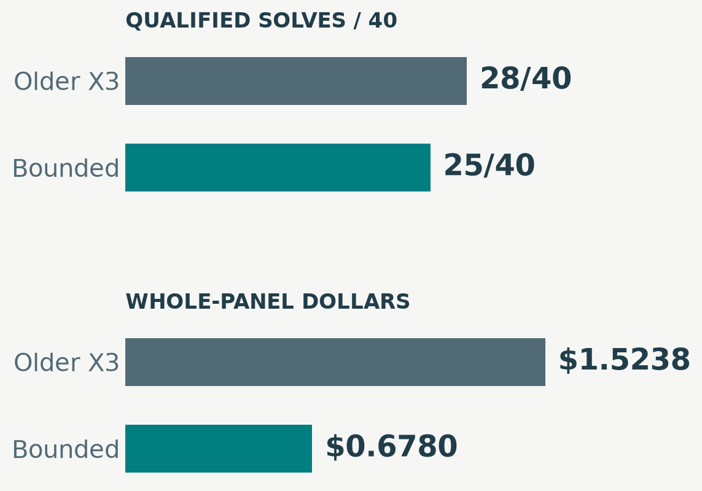
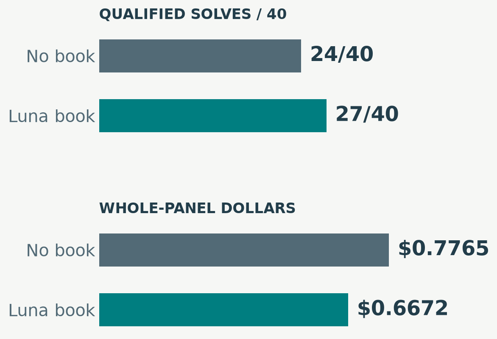
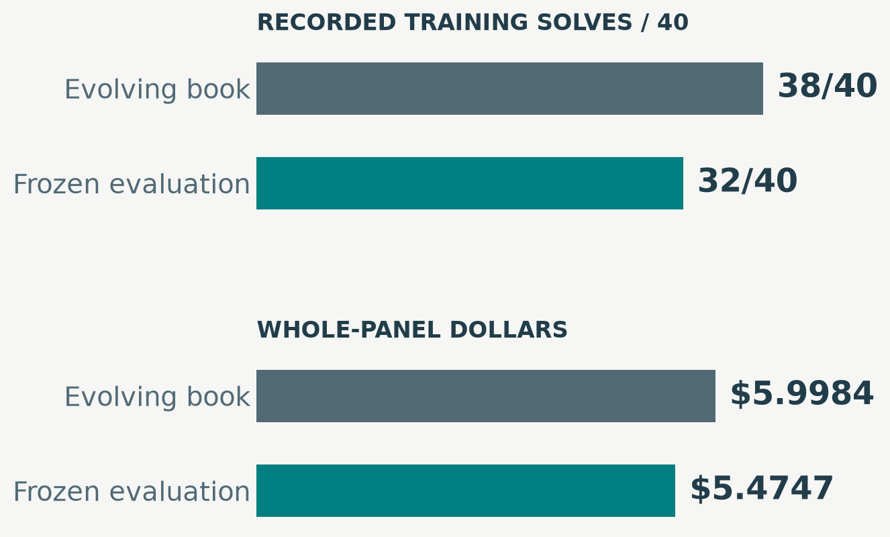
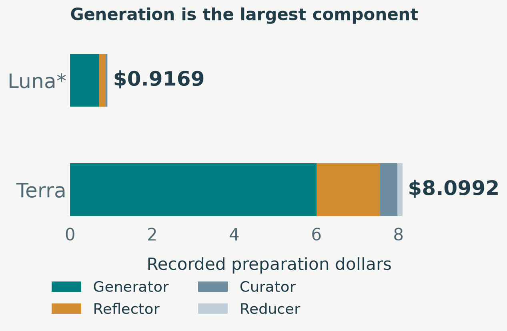
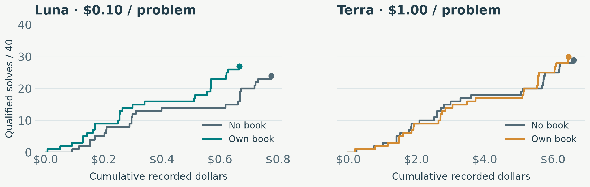
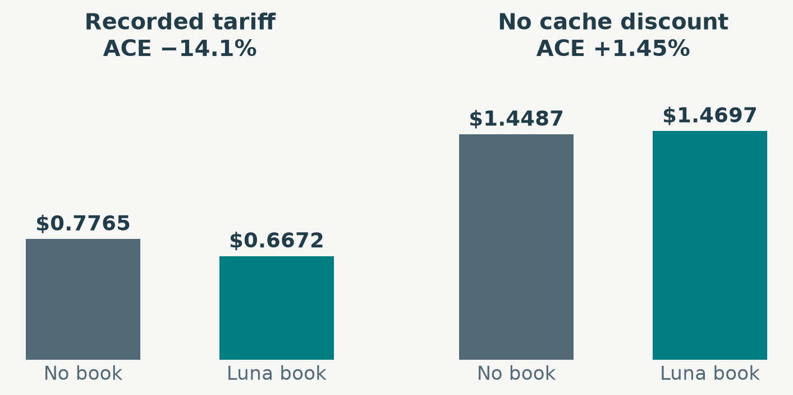
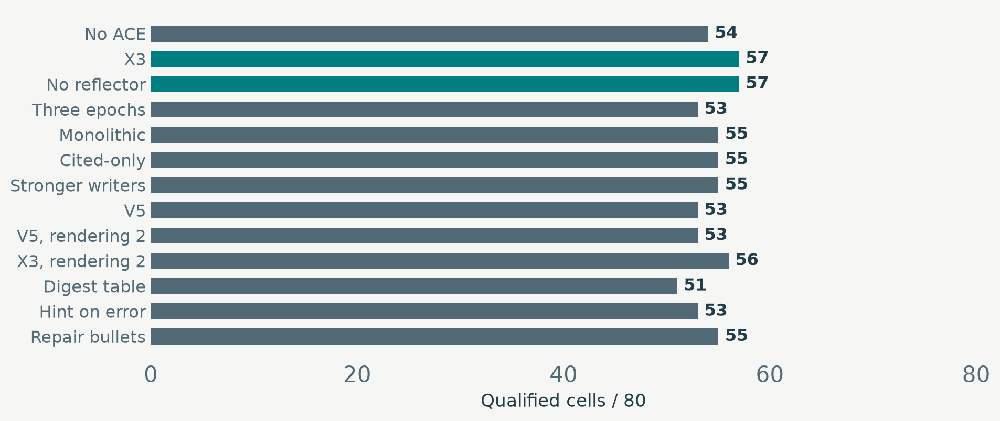

<!-- Generated from advisor_deck.yaml by build_advisor_deck.py. -->

# 01 · ACE, control and the cost of a proof

*Research update*

Omphalos / Delphyne / miniF2F in Rocq

**−55.5%**

- **spending**: Accepted bounded-control trade-off; 28 → 25 validation solves.

**+3 / 40**

- **Luna ACE increment**: Matched development comparison; encouraging, p = 0.25.

**38 / 40**

- **Terra during learning**: Training generation; later frozen evaluation uses a different controller.

- **Thesis contribution:** economical, verifiable search through Delphyne.

- **Main question:** which improvements survive the entire path to a checked proof?

> Strong control result; modest ACE signal; concrete explanations for lost opportunity.

::: notes
Open with the three numbers. They belong to different comparisons. Never present 38/40 as validation performance. This is a complete reading deck; use the rehearsal route for a shorter talk.
:::

# 02 · The questions this update answers

*Reading guide*

**Is ACE implemented?**

- **Yes:** Generator, Reflector, Curator and persistent playbook.

- **Local additions:** batched Reducer, checked evidence and budget controls.

**Did it improve coverage?**

- **Luna:** 24 → 27/40 in the matched validation comparison.

- **Uncertain:** three gains; too little evidence for a supported general gain.

**Does a stronger model unlock ACE?**

- **Terra solves more** without a book.

- **ACE increment stays small:** +0 with Luna’s book, +1 with its own.

**What is worth retaining?**

- **Budget trade-offs and reliable evidence.**

- **Failed candidates stay optional;** common controller limitations remain.

> Separate implementation fidelity, local correctness, coverage and economic value.

::: notes
Use these questions as a map. Each is answered visibly later; no claim depends on speaker notes or a live file visit.
:::

# 03 · Our ACE loop, in one slide

*Implementation*

- **Generator:** Propose a proof using the current book

- **Rocq feedback:** Execute and check what actually happened

- **Reflector:** Diagnose the attempt; propose useful lessons

- **Curator:** Propose structured playbook changes

- **Reducer:** Select / combine batched proposals

- **Merge + store:** Deterministic update; hash the next book

- **Training:** the book evolves between batches; no model weights are updated.

- **Evaluation:** the selected book is frozen; each proof has its own resource allowance.

- **Delphyne:** strategies describe choices; policies choose models, search and spending.

> The Reducer is a local batching component; the deterministic merge owns the stored state.

::: notes
The advisor knows ACE. Spend at most 45 seconds here. Emphasize the local Reducer and the separation between the evolving book and frozen inference.
:::

# 04 · Where each ACE element lives in the code

*Implementation / navigation*

| ACE element | Delphyne strategy / query | File to open · then search symbol |

| --- | --- | --- |

| **Generator** | prove_theorem_ace / ProposeProofScriptACE | prove_ace.py |

| **Reflector** | reflect_on_trajectory / ReflectOnTrajectory | prove_ace.py |

| **Curator** | curate_playbook / CuratePlaybook | prove_ace.py |

| **Reducer** | aggregate_curation_deltas / AggregateCurationDeltas | prove_ace.py |

| **Book + merge** | Playbook / merge / refine; PlaybookStore.put | ace/ace_playbook.py; ace/ace_store.py |

| **Driver** | execute / ACEAdaptStepConfig | experiments/ace/ace_adaptation.py |

> All paths are relative to examples/omphalos; search by symbol because active code can move lines.

::: notes
Optional visit 1: prove_ace.py; compare the four strategies and their policy functions. Visit 2: ace/ace_playbook.py merge; then ace/ace_store.py PlaybookStore.put. Mapping describes the measured architecture, not unbenchmarked work in the other session.
:::

# 05 · What counts as a solve—and what is capped?

*Measurement*

| Setting | Dollar allowance / problem | Requests / verifier | Interpretation |

| --- | --- | --- | --- |

| Historical X / Luna | **$0.10** | 32 requests | Older post-crossing stopping |

| Bounded / Luna | **$0.10** | 64 / 300 seconds | Conservative pre-request admission |

| Bounded / Terra | **$1.00** | 64 / 300 seconds | Same controller; recorded tariffs ×10 |

| Terra training Generator | **$1.00 nominal** | 32 requests | Evolving book; older stopping rule |

- **Qualified solve:** verifier success within the stated cost rule.

- **Bill includes failures;** book preparation is separate.

- **40 problems per X partition;** validation is reused development data.

> A nominal allowance, a request reservation and the eventual bill are different quantities.

::: notes
Do not conflate the original canonical $0.05 setting with X experiments. The slide deliberately gives the settings behind the principal comparisons. testX and protected challenge outcomes remain excluded.
:::

# 06 · Development cycles 1/4 · replication and X3

*Complete development history*

| Cycle / change | Observed development result | Conclusion / disposition |

| --- | --- | --- |

| **Initial replication** | ACE = baseline: **32/40 cells**; $0.5058 vs $0.4446 | No coverage gain; 20 original validation problems × 2 seeds. |

| **Initial ablations / definitions** | No-Reflector changes book composition; definitions fix **1/8** cells | No context-collapse replication at this scale; preserve the input fix. |

| **X v2: offline / online** | Offline **54/80** = baseline; cold online **56/80**; warm **50/80** | Warm start does not reliably improve results. |

| **X3: batched evidence** | X3 **57/80** vs baseline **54/80** | Modest gain; one-epoch book becomes the reference. |

| **Reflection / rewriting / epochs** | No-Reflector **57/80**; monolithic **55/80**; X3 3 epochs **53/80** | More reflection / training is not reliably better. |

> For X rows, 80 cells = the same 40 validationX problems at two replicate identifiers.

::: notes
These are development reconstructions, not independent repeated confirmations. Early incomplete top-k, no-Reflector and online archives are not scored as complete panels. All later X counts use their explicitly named versions; v2 three epochs scored 50/80.
:::

# 07 · Development cycles 2/4 · better advice and delivery

*Complete development history*

| Cycle / change | Observed development result | Conclusion / disposition |

| --- | --- | --- |

| **X4: cited-only credit** | **55/80** vs X3 **57/80** | Better bookkeeping; citations do not establish causal usefulness. |

| **Stronger writers / v5** | Terra writers **55/80**; v5 **53/80** | More capable writing and richer failure evidence do not beat X3. |

| **Rendering v2 vs v3** | Cost effect changes sign across v5 and X3 books | Rendering effect depends on the book. |

| **Hints on error / x6 repairs** | Triggered **53/80**; repairs **56 raw / 55 qualified** | Some repairs help locally; no reliable large coverage gain. |

| **Stall stopping: k = 4** | **26/40**, $0.7943 vs **27/40**, $0.8870 | Spend less with one fewer solve; live and offline estimates differ. |

| **Deterministic digest table** | **51/80** vs X3 rendering 2 **56/80** | Simple summaries lose coverage; effect uncertain. |

> Advice can be correct, cheaper to send, or more traceable without completing more theorems.

::: notes
The stronger-writer treatment still uses Luna as Generator. The later all-Terra training chain is different. x6 has one raw success above the retrospective $0.10 qualification threshold. Old cost exports do not necessarily contain every retry receipt.
:::

# 08 · Development cycles 3/4 · control and local checks

*Complete development history*

| Cycle / change | Observed development result | Conclusion / disposition |

| --- | --- | --- |

| **Review development stage** | X3 **57/80**; repair books **55 / 54 raw**; baseline **52/80** | Repair books do not beat X3; protected stages excluded. |

| **Bounded money + focused** | **25/40** vs **28/40**; spending **−55.5%** | **Accepted trade-off**; original no-loss gate failed. |

| **Control-cycle follow-up** | **28/40**, $1.0253 vs **25/40**, $0.6780 | Coverage bought back at higher cost; Pareto gate failed. |

| **Polish / downshift / recovery** | **53/80** each; candidate bill **+5.55%** | No benchmark win; keep optional. |

| **Applicability / checked change** | Adaptive **2/12** useful vs fixed **3/12**; checked change **1→2/6** | Local correctness helps; full-theorem gains unestablished. |

| **Local reasoning-effort probes** | Terra low/medium/high **4/6** each; Luna high/xhigh **5/6** | More reasoning is not monotonic; check the right local operation. |

> Local episodes, theorem cells and campaign bills have different denominators.

::: notes
Applicability primary screen stopped; no full train/validation benchmark followed. Checked-change correctness improved 3/6 to 6/6. The control-cycle archived source has reconstruction limitations; do not quietly rerun it as the same experiment.
:::

# 09 · Development cycles 4/4 · coverage and attribution

*Complete development history*

| Cycle / change | Observed development result | Conclusion / disposition |

| --- | --- | --- |

| **Model / writer-effort suite** | Pilot **18/24 vs 17/24**; full contenders **19 / 24 vs 27/40** | Promising pilot did not become a coverage upgrade. |

| **Structured mechanisms** | Effort arm **43/80 vs 53/80**; S/C/R have **51 parse failures** | No promotion; parser confounds mechanism interpretation. |

| **Fixed-book demos / exploration** | D/E validation **26 / 25 vs 27/40** | No coverage gain; unchanged book. |

| **Four isolated coverage arms** | D2/E2/S/H **25 / 24 / 25 / 25 vs 27/40** | All cost more on validation; retain the reference. |

| **Attribution / capacity** | Own-book increment: Luna **+3**, Terra **+1**; training Terra **38/40** | Solver strength exceeds demonstrated ACE increment. |

| **13 Sep: resource completion** | Small cap **26/40**; continuation **23/40** vs **27/40** | Both cost more; no follow-up selected, no promotion. |

> Completed cycles are preserved as evidence; the latest losing variants are not the new default.

::: notes
The September 13 row is a completed snapshot, not a report on the other active session. Costs and controller details appear later. The ledger and archival scores are left unchanged.
:::

# 10 · The strongest result is a budget trade-off

*Control result*

- **Coverage:** 28 → 25 / 40.

- **Bill:** $1.5238 → $0.6780; **55.5% less**.

- **Cost per solve:** $0.0544 → $0.0271.

- **Accepted:** three fewer solves for lower cost; no-loss gate failed.

> Both use a nominal $0.10/problem allowance; the controller changes what gets admitted.

::: notes
The comparator is the older review X3 seed-0 run, not the latest 27/40 flagship. Total cost includes failed attempts. Categorical bars show measured alternatives; there is no interpolated budget-response curve.
:::

# 11 · A changed baseline explains part of the confusion

*Attribution*

| Program | trainX | validationX | Validation bill |

| --- | --- | --- | --- |

| Earlier / no book | **33/40** | **27/40** | $0.8870 |

| Bounded / no book | **28/40** | **24/40** | $0.7765 |

| Bounded / Luna book | **28/40** | **27/40** | $0.6672 |

- **Earlier → current no book:** five training and three validation solves lost.

- **Current no book → ACE:** three validation solves recovered.

- **Current ACE vs earlier program:** same validation count; bill **24.8% lower**.

> All use Luna and $0.10/problem; controller, feedback and runtime lineage still differ.

::: notes
The first arrow is a historical program comparison, not a paired single-feature ablation. The second is the intended book intervention within the bounded program, still subject to historical/provider conditions. File: experiments/campaigns/ace_attribution_20260912/LINEAGE.md.
:::

# 12 · Luna’s book helps here—but the signal is small

*Matched ACE result*

- **Question:** does this book help the bounded solver?

- **Observed:** 24 → 27/40; three gains, no losses.

- **Economics:** $0.7765 → $0.6672; bill **−14.1%**.

- **Uncertain:** paired p = **0.25**.

> Luna / medium / $0.10 per problem / 64 requests / 300 verifier seconds.

::: notes
Do not say ACE is proved effective, proved ineffective, or equivalent. The whole-panel count is more informative than a count of cherry-picked repaired cases. Cache economics are separated later.
:::

# 13 · The full crossover separates solver from book

*Luna / Terra experiment*

| Solver / book | Solves / 40 | Cost | Cap |

| --- | ---: | ---: | ---: |

| gpt-5.6-luna/luna | 27 | $0.667228 | $0.10 |

| gpt-5.6-luna/none | 24 | $0.776512 | $0.10 |

| gpt-5.6-luna/terra | 24 | $0.734194 | $0.10 |

| gpt-5.6-terra/luna | 29 | $6.852274 | $1.00 |

| gpt-5.6-terra/none | 29 | $6.610626 | $1.00 |

| gpt-5.6-terra/terra | 30 | $6.451344 | $1.00 |

- **Same Luna book:** +3 solves for Luna, **+0** for Terra.

- **Terra-written book:** no gain for Luna; **+1** for Terra.

- **Own-book Terra:** **9.67×** the bill for three more validation solves.

> Each cell is 40 validationX problems; costs include failures and exclude book preparation.

::: notes
Rows are solver models, columns are frozen books. Luna cap $0.10; Terra $1.00. Same-book interaction −7.5 percentage points, paired p=0.375. Own-Terra book increment p=1.0. Reused records do not become independent theorems.
:::

# 14 · What the Luna / Terra experiment changes

*Interpretation*

**Stronger solver: yes, more coverage**

- **Without ACE:** Terra 29/40; Luna 24/40.

- **Cost matters:** Terra uses a $1.00 cap and recorded tariffs ×10.

**Stronger writer: no clear unlock**

- **Luna + Terra book:** 24/40, matching no book.

- **Terra + own book:** only 29 → 30/40.

**Training success vs book usefulness**

- **Generator:** Terra 38/40; Luna 33/40.

- **Transfer still needs** valid, relevant advice that the solver uses.

**Next inference to test**

- **Target exposed bottlenecks** in evidence or completion.

- **Larger models and more writing** do not guarantee an ACE gain.

> The study does not establish that model scale unlocks ACE; an intrinsic model ceiling also remains unproven.

::: notes
Avoid a categorical statement that Terra cannot benefit. The same-book interaction has p=0.375 and the own-Terra difference p=1.0. Small gains and the study design limit conclusions.
:::

# 15 · Yes: Terra achieved 38/40 during book creation

*The 38/40 result*

- **38/40 on trainX:** the book evolved between batches.

- **Generator bill:** $5.9984 for all 40 tasks.

- **Full preparation:** $8.0992, including writers and embeddings.

- **Frozen book:** trainX **32/40**; validationX **30/40**.

> 38 → 32 compares two training executions; 30/40 is a different partition, not another measured decline.

::: notes
Terra is used for all four generative roles. One shuffled pass, four-problem batches, final book 26 bullets / 2426 estimated tokens. The two training-generation misses were algebra_amgm_sum1toneqn_prod1tonleq1 and imo_1967_p3. Source: training_evolution.json and training_accounting.json in ace_attribution_20260912.
:::

# 16 · Why did 38 become 32? What we know—and do not

*Controller and context*

**Known change · request admission**

- **Training:** 32 requests; stop after a budget crossing.

- **Evaluation:** up to 64; reservations can deny the next call.

**Known change · context**

- **Training:** evolving book; older proof loop.

- **Evaluation:** frozen book; focused queries and bounded verifier feedback.

**Known issue · completion is fragile**

- **Unfinished progress:** time limits, parsing and final submission matter.

- **More nominal requests** do not guarantee useful admitted work.

**Unknown · the causal breakdown**

- **Different sampled trajectories:** this is not a paired controller ablation.

- **Six net solves lost ≠ six proven reservation failures.**

> The gap motivates diagnosis; it does not show that the finished book destroyed six proofs.

::: notes
Same nominal Terra generator allowance $1.00, different stopping semantics. Do not assign a numerical share of the six-solve gap to the controller, compression or sampling without a matched intervention.
:::

# 17 · Creating a book is a real up-front expense

*Economics / preparation*

- **Luna:** ≥ $0.9169; historical embeddings unknown.

- **Terra:** $8.0992; **8.83×** Luna’s known cost.

- **26 bullets each;** below the 4,000-token guard.

- **Payback requires** useful lessons to survive reduction.

> Preparation and inference are separate bills; generation is the largest preparation component.

::: notes
The bars are additive costs, not a learning curve. Luna final size 2103 estimated tokens; Terra 2426. Breakeven uses assumed future workloads and belongs in the backup question.
:::

# 18 · Spent versus solved: the actual recorded staircase

*Economics / whole panel*

- **Right without up:** money spent without a solve. **Up:** a qualified proof.

- **Fixed task order; all 40 costs.** Accounting paths, not simulated smaller-cap runs.

> Luna endpoints: 24 / $0.7765 vs 27 / $0.6672. Terra: 29 / $6.6106 vs 30 / $6.4513.

::: notes
Two model-specific dollar scales avoid squeezing Luna into an unreadable sliver. Step plots preserve discrete solve increments. Do not smooth these observations or imply the task order is an optimized execution policy.
:::

# 19 · Cache discounts change the economic conclusion

*Economics / sensitivity*

- **Observed Luna bill:** ACE saves **14.1%**.

- **No cache discount:** the same tokens cost **1.45% more** with ACE.

- **Cached share:** 64.6% → **75.9%**; token use rises slightly.

- **Terra:** own-book uncached sensitivity is **+8.51%**.

> The saving is real at the observed tariff; it cannot all be attributed to less computation.

::: notes
This counterfactual reprices the same trajectories; it does not rerun the models or change admission behavior. Bar pairs deliberately replace straight-line trajectories between unrelated price scenarios.
:::

# 20 · Four failure mechanisms behind weak transfer

*Mistakes and lessons*

**1 · The wrong successful ending**

- **Accepted ending: nia.** Missing from the last proposed script.

- **Risk:** teach a different action from the one that closed the proof.

**2 · Invalid syntax in a valid idea**

- **Reducer:** valid assert becomes rejected have syntax around Rle_0_sqr.

- **Name lookup is insufficient:** verify the snippet in its source context.

**3 · A mechanism that never arrives**

- **51 parse failures; 33 duplicates.**

- **Concatenated final messages** break parsing; evaluate the fix separately.

**4 · Shorter context, longer search**

- **Compaction:** repeated tool calls; sometimes no proof submission.

- **Local savings** can lose useful memory and completion opportunity.

> Capture → validate → retain → expose → use → finish. A failure anywhere can erase the benefit.

::: notes
Terminal witness: amc12_2000_p6. The missing-text flag alone does not prove every affected training lesson was wrong. Syntax acceptance is not full theorem success; exposure is not causal attribution.
:::

# 21 · More allowance recovered Terra proofs, then stalled

*Exact continuations*

- Luna / C: 4 → 4 → 4 solves / 8.

- Luna / E: 3 → 3 → 3 solves / 8.

- Terra / C: 4 → 6 → 6 solves / 8.

- Terra / E: 3 → 7 → 7 solves / 8.

- **Same paid prefixes:** eight selected trainX problems; no fresh restarts.

- **Extra money:** Luna unchanged; Terra gains **+2 / +4** solves.

- **Then no extra solves:** 11 residual paths face money denial; one carries an API failure.

> The final plateau is not evidence of an unrestricted model-capability ceiling.

::: notes
C = no ACE; E = corrected own-book context. Level 0 caps Luna $0.10 / Terra $1.00. Level 1 doubles money to $0.20 / $2.00 while retaining 64 requests / 300s. Level 2 retains that money and gives 128 requests / 600s. Costs in backups include each prefix once.
:::

# 22 · 13 September: the first completion fixes did not win

*Latest completed cycle*

| Treatment | trainX | validationX | Validation bill |

| --- | --- | --- | --- |

| **Historical reference** | 28/40 | **27/40** | **$0.6672** |

| A · output cap 4,096 | **30/40** | 26/40 | $1.1281 |

| B · corrected continuation | 25/40 | 23/40 | $0.7379 |

- **A exposed more search, but did not improve validation economics.**

- **Both gates failed:** no selected follow-up; neither becomes the default.

- **Cost:** $3.6136 of a $30 ceiling; Luna / medium / $0.10 per problem.

> A reduces the response cap from 32,768 to 4,096 tokens. Completed cycle; ongoing code work is unscored.

::: notes
These are historical seed-0 controls and fresh candidate trajectories. Validation is reused development data. The frozen book is unchanged. Output cap is a model-response limit including reasoning, not the final visible proof length.
:::

# 23 · Are failed ideas inherited by later experiments?

*Research discipline*

**Stored in Git**

- **Keep results, costs, books and candidate code.**

- **A research commit does not establish a solver improvement.**

**Activated by configuration**

- **Opt-in:** compaction, exploration, repair and continuation.

- **The next control retains the reference;** losing flags stay off.

**What really is inherited**

- **The accepted controller** and its cost / coverage compromise.

- **Shared code changes** can affect several configurations.

**Remaining protection to strengthen**

- **One explicit reference constructor;** preserve prompt identity.

- **Separate archive, fix and promotion;** check shared behavior.

> Optional treatments are isolated by switches; shared-code behavior still deserves regression checks.

::: notes
This is an assessment of inspected configuration and history, not a proof of complete behavioral equivalence. Raw BoundedConfig defaults differ from the reference’s explicit admission=False / restart=False settings. No code is changed by preparing this presentation.
:::

# 24 · The thesis claim and the advisor decisions

*Discussion*

**Claim supported by the work**

- **ACE in Delphyne:** explicit artifacts and verifier feedback.

- **Useful cost / coverage control;** concrete failure diagnoses.

**Claim that stays open**

- **A general, reproducible ACE coverage gain.**

- **An intrinsic Luna ceiling** or a general stronger-writer advantage.

**Where further work earns its cost**

- **Faithful, executable evidence.**

- **Local progress must become an accepted proof** within the full budget.

**Decisions for the meeting**

- **Which cost / coverage trade-off serves the thesis?**

- **What evidence is still needed?** Use trainX / validationX; testX stays closed.

> Evaluate improvements by completed proofs and the whole bill, with mechanism exposure recorded.

::: notes
Close with decisions, not a promise that the active code work will succeed. The original $30 proposal has begun; the completed first cycle is already included. No new budget or experiment is requested by this deck.
:::

# 25 · What are the exact crossover costs and caps?

*Backup / exact values*

| Solver / book | Solves / 40 | Cost | Cap |

| --- | ---: | ---: | ---: |

| gpt-5.6-luna/luna | 27 | $0.667228 | $0.10 |

| gpt-5.6-luna/none | 24 | $0.776512 | $0.10 |

| gpt-5.6-luna/terra | 24 | $0.734194 | $0.10 |

| gpt-5.6-terra/luna | 29 | $6.852274 | $1.00 |

| gpt-5.6-terra/none | 29 | $6.610626 | $1.00 |

| gpt-5.6-terra/terra | 30 | $6.451344 | $1.00 |

- **One row = 40 validationX problems.** Recorded inference spending includes failures.

- **Preparation excluded;** historical controls reused; not 240 independent theorems.

> Luna / medium / $0.10 cap; Terra / medium / $1.00 cap; 64 requests and 300 verifier seconds.

::: notes
Exact source: report/ace_retrospective/data/crossover.csv. Own-book p-values: Luna 0.25; Terra 1.0. The full crossover tests solver/book combinations, not a general scaling law.
:::

# 26 · Which historical books improved coverage?

*Backup / historical comparison*

- **X3 and no-Reflector:** 57/80 versus no ACE **54/80**; differences remain modest.

- **Repair bullets:** 56 raw successes; **55 qualify** under the retrospective cost rule.

> Two replicate identifiers on 40 validationX problems; separate books and delivery methods.

::: notes
Directly labeled horizontal bars show categorical treatments. Bills were repriced from tokens at the audited snapshot; they are not guaranteed complete historical retry receipts. Incomplete arms are excluded, not silently counted as full panels.
:::

# 27 · How can a run stop while money remains?

*Backup / admission semantics*

- **Reserve input and maximum output charges** before dispatch.

- **Bound above balance → deny.** The hypothetical actual bill is unknown.

- **A smaller cap also constrains reasoning;** the 4,096-token trial did not win.

> Unused money is not automatically spendable; looser admission must still respect financial protection.

::: notes
Illustrative recorded continuation: remaining $0.085742, next reservation $0.086368. This is $0.000626 over the balance. File: runtime/campaign_budget.py, CampaignResponsesModel.estimate_budget and Ledger.reserve. Do not make all reservations unsafe just to admit more calls.
:::

# 28 · When would preparing the book pay for itself?

*Backup / amortization*

| Quantity | Luna | Terra |

| --- | --- | --- |

| Known preparation bill | **≥ $0.9169** | **$8.0992** |

| Inference saving / 40 tasks | $0.1093 | $0.1593 |

| Conditional break-even workload | **≈ 336 tasks** | **≈ 2,034 tasks** |

- **Assumptions:** unchanged task mix, coverage, prices, cache reuse and usefulness.

- **Denominator:** future attempted problems; unsuccessful attempts also count.

- **Not included:** engineering / assistant costs; Luna’s missing historical embeddings.

> This is arithmetic under fixed assumptions, not a prediction of external generalization.

::: notes
Break-even = known preparation cost divided by observed per-attempt inference saving. Values are rounded upward to whole attempted tasks. No extrapolated straight-line chart is needed to convey these conditional figures.
:::

# 29 · Which evidence should an ACE lesson retain?

*Backup / evidence*

**Proposal and execution**

- **The exact submitted script** and the prefix actually executed.

- **Accepted terminal proof,** including automatic assistance such as nia.

**The concrete witness**

- **amc12_2000_p6:** final_check.success = true.

- **nia. accepted; missing from proposal.** The proof succeeded.

**From source to lesson**

- **Context, bindings and checked snippet** attached to the lesson.

- **Preserve valid syntax** through reflection, curation and reduction.

**From lesson to benefit**

- **Show delivery and use** in the later operation.

- **Then measure full proofs and total spending;** local validity is insufficient.

> File to inspect: report/ace_retrospective/data/creator_terminal_evidence.json, entry 0.

::: notes
Other fields and full paths are in rehearsal_excerpts.md. Seven of 33 source successes have a missing terminal-tactic text flag; this is not seven established identical causal errors.
:::

# 30 · Why is +3 solves not yet a supported gain?

*Backup / measurement rules*

**What the three gains say**

- **3 gains, 0 losses:** paired exact p = **0.25**.

- **No proof of a general effect;** also no proof that ACE has zero value.

**What counts as evidence**

- **All expected cells;** platform failures retained in the denominator.

- **Whole-panel costs,** including failed attempts, retries and known liabilities.

**What is independent**

- **Cluster related theorem families and repeated seeds.**

- **validationX is reused development data;** selection is not confirmation.

**What permits a practical decision**

- **Support:** two-sided p < 0.10; 90% intervals.

- **Expansion, trade-off and promotion** are separate decisions; preserve gates.

> Do not buy extra seeds merely to cross a significance threshold; testX stays closed.

::: notes
Five independent all-favorable discordances give exact two-sided p=0.0625. This is a minimum for attainable significance, not a power calculation. Small samples and historical controls warrant restrained interpretation.
:::

# 31 · Which files should I rehearse before presenting?

*Backup / navigation*

| Question | File · relative to examples/omphalos | Search / inspect |

| --- | --- | --- |

| **How is ACE wired?** | prove_ace.py | prove_theorem_ace; ReflectOnTrajectory |

| **How is the book stored?** | ace/ace_playbook.py; ace/ace_store.py | merge; refine; PlaybookStore.put |

| **Where is 38/40?** | experiments/campaigns/ace_attribution_20260912/RESULTS.md | Playbook creation; Generator solves |

| **What stopped a call?** | runtime/campaign_budget.py | estimate_budget; Ledger.reserve |

| **Terminal witness?** | report/ace_retrospective/data/creator_terminal_evidence.json | entry 0; final_check; last_tactic |

> Read-only rehearsal; no experiment launch, partition loader or live model call is needed.

::: notes
A short presentation route and file checklist are in advisor_rehearsal.md / advisor_rehearsal.pdf. The older rehearsal_notes files describe the previous sixteen-slide deck.
:::
